# 多层级项目合同管理平台 - 产品架构设计方案

## 文档说明

本文档基于以下核心设计决策：
1. **项目层级深度**：最多4层
2. **合同独立性**：子项目合同独立，但隶属架构层级不变
3. **跨合同验收权限**：层级间人员验收不受限制
4. **数据汇总频率**：初期版本实时计算
5. **商业化优先级**：前期业务运营模式跑通，简单化

---

## 一、项目架构层级与合同关系模型

### 1.1 项目层级架构设计

#### 1.1.1 项目层级定义

```
层级1：主项目（Level 1 - Main Project）
    └── 层级2：子项目（Level 2 - Sub Project）
            └── 层级3：孙项目（Level 3 - Grand Project）
                    └── 层级4：任务包（Level 4 - Task Package）
```

**层级说明**：

| 层级 | 名称 | 说明 | 示例 |
|------|------|------|------|
| Level 1 | 主项目 | 最顶层项目，代表完整的业务项目 | XX小区整体装修项目 |
| Level 2 | 子项目 | 主项目的第一级分解 | 水电工程、泥瓦工程、木工工程 |
| Level 3 | 孙项目 | 子项目的进一步分解 | 强电工程、弱电工程、给排水工程 |
| Level 4 | 任务包 | 最小执行单元 | 开槽布线、开关安装、灯具安装 |

#### 1.1.2 项目层级架构图

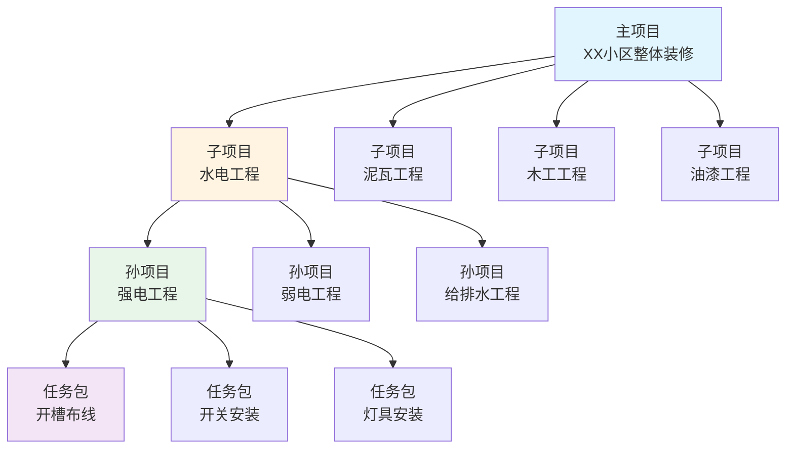

#### 1.1.3 项目层级数据模型

```sql
CREATE TABLE project_hierarchy (
    id BIGINT PRIMARY KEY COMMENT '项目ID',
    project_code VARCHAR(50) UNIQUE COMMENT '项目编码',
    project_name VARCHAR(200) NOT NULL COMMENT '项目名称',
    
    -- 层级信息
    level INT NOT NULL COMMENT '层级：1-主项目 2-子项目 3-孙项目 4-任务包',
    parent_id BIGINT COMMENT '父项目ID',
    root_id BIGINT COMMENT '根项目ID（主项目ID）',
    path VARCHAR(500) COMMENT '层级路径，如：1/2/3',
    
    -- 项目信息
    project_type TINYINT COMMENT '项目类型：1-家装 2-工装',
    project_status TINYINT DEFAULT 1 COMMENT '状态：1-待启动 2-进行中 3-已完工',
    
    -- 预算信息
    budget DECIMAL(12,2) COMMENT '预算金额',
    actual_cost DECIMAL(12,2) COMMENT '实际成本',
    
    -- 进度信息
    progress INT DEFAULT 0 COMMENT '进度百分比',
    
    -- 时间信息
    plan_start_date DATE COMMENT '计划开始日期',
    plan_end_date DATE COMMENT '计划结束日期',
    
    -- 其他
    owner_id BIGINT COMMENT '项目负责人ID',
    create_time DATETIME DEFAULT CURRENT_TIMESTAMP,
    update_time DATETIME DEFAULT CURRENT_TIMESTAMP ON UPDATE CURRENT_TIMESTAMP,
    
    INDEX idx_parent_id (parent_id),
    INDEX idx_root_id (root_id),
    INDEX idx_level (level)
) COMMENT='项目层级表';
```

---

### 1.2 合同层级关系设计

#### 1.2.1 合同独立性原则

**核心原则**：
- 每个层级的项目都可以独立签订合同
- 子项目合同独立于主项目合同，但隶属架构层级不变
- 合同的签署、执行、结算相互独立
- 合同金额向上汇总，形成项目总金额

#### 1.2.2 合同层级关系图

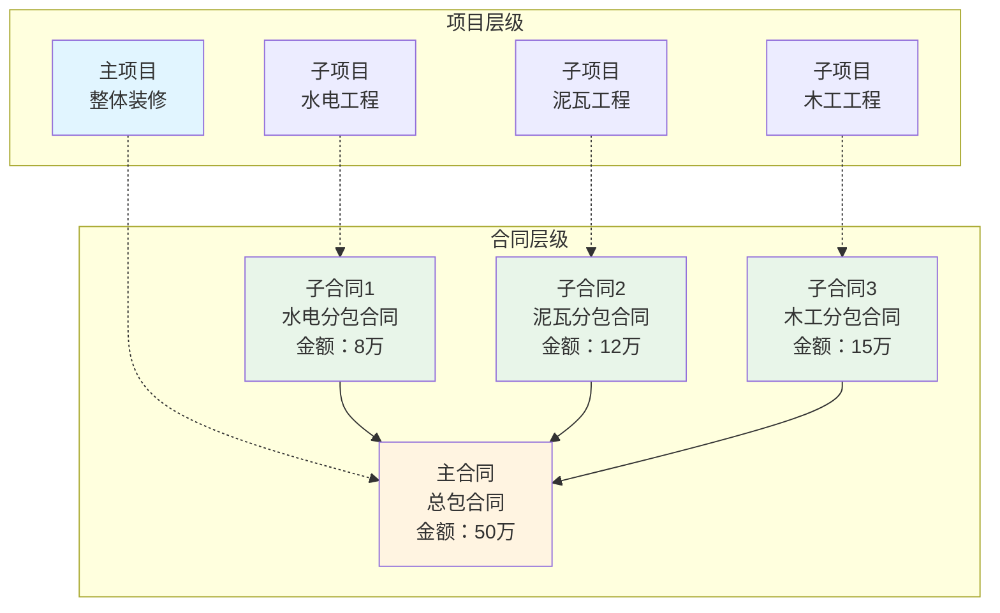

#### 1.2.3 合同数据模型

```sql
CREATE TABLE contract_hierarchy (
    id BIGINT PRIMARY KEY COMMENT '合同ID',
    contract_code VARCHAR(50) UNIQUE COMMENT '合同编码',
    contract_name VARCHAR(200) NOT NULL COMMENT '合同名称',
    
    -- 关联项目
    project_id BIGINT NOT NULL COMMENT '关联项目ID',
    project_level INT COMMENT '项目层级',
    
    -- 合同双方
    party_a_id BIGINT NOT NULL COMMENT '甲方ID',
    party_b_id BIGINT NOT NULL COMMENT '乙方ID',
    
    -- 合同金额
    contract_amount DECIMAL(12,2) COMMENT '合同金额',
    paid_amount DECIMAL(12,2) DEFAULT 0 COMMENT '已支付金额',
    
    -- 合同状态
    contract_status TINYINT DEFAULT 1 COMMENT '状态：1-草稿 2-待签署 3-执行中 4-已完成',
    
    -- 合同层级关系
    parent_contract_id BIGINT COMMENT '父合同ID',
    is_independent TINYINT DEFAULT 1 COMMENT '是否独立：1-是 0-否',
    
    -- 时间信息
    sign_time DATETIME COMMENT '签署时间',
    start_date DATE COMMENT '开始日期',
    end_date DATE COMMENT '结束日期',
    
    create_time DATETIME DEFAULT CURRENT_TIMESTAMP,
    update_time DATETIME DEFAULT CURRENT_TIMESTAMP ON UPDATE CURRENT_TIMESTAMP,
    
    INDEX idx_project_id (project_id),
    INDEX idx_parent_contract_id (parent_contract_id)
) COMMENT='合同层级表';
```

---

### 1.3 项目-合同-任务三层关系模型

#### 1.3.1 三层关系架构图

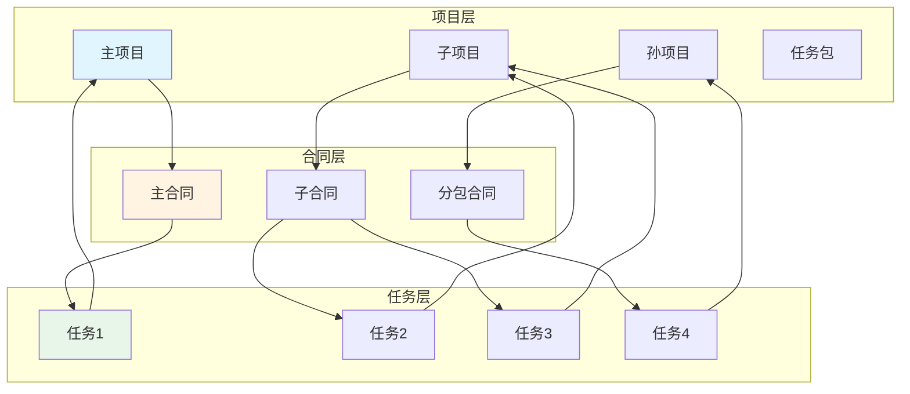

#### 1.3.2 数据流向

```
任务层 → 合同层 → 项目层

进度数据流：
任务进度 → 合同进度 → 项目进度
（子项目进度 = 所有任务进度加权平均）
（主项目进度 = 所有子项目进度加权平均）

成本数据流：
任务成本 → 合同成本 → 项目成本
（合同成本 = 所有任务成本汇总）
（项目成本 = 所有子项目成本汇总）

金额数据流：
合同金额 → 项目预算
（项目预算 = 所有子合同金额汇总）
```

#### 1.3.3 关系数据模型

```sql
CREATE TABLE task_contract_relation (
    id BIGINT PRIMARY KEY,
    task_id BIGINT NOT NULL COMMENT '任务ID',
    contract_id BIGINT NOT NULL COMMENT '合同ID',
    project_id BIGINT NOT NULL COMMENT '项目ID',
    
    -- 关系类型
    relation_type TINYINT COMMENT '关系类型：1-直接关联 2-跨合同关联',
    
    create_time DATETIME DEFAULT CURRENT_TIMESTAMP,
    
    INDEX idx_task_id (task_id),
    INDEX idx_contract_id (contract_id),
    INDEX idx_project_id (project_id)
) COMMENT='任务-合同-项目关系表';
```

---

## 二、跨合同协作机制设计

### 2.1 跨合同协作场景分析

#### 2.1.1 场景一：子项目任务由主项目人员验收

**场景描述**：
- 主项目：整体装修项目（业主与平台签订主合同）
- 子项目：水电工程（平台与水电施工队签订分包合同）
- 监理：主合同中指定的监理人员
- 验收：水电工程的任务需要监理（主合同人员）验收确认

**协作流程**：

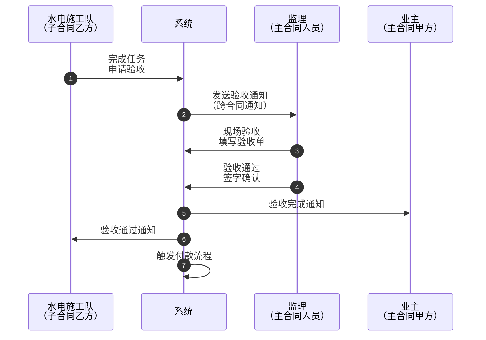

#### 2.1.2 场景二：子项目任务影响主项目进度

**场景描述**：
- 水电工程延期，影响整体装修进度
- 需要将延期信息同步到主项目层面
- 主项目负责人需要协调资源或调整计划

**协作机制**：

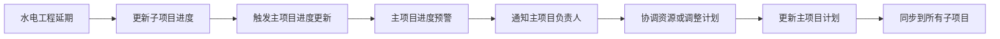

#### 2.1.3 场景三：跨合同资源调配

**场景描述**：
- 多个子项目共享同一批材料
- 需要在不同合同间协调材料使用
- 材料成本需要分摊到各合同

**协作机制**：

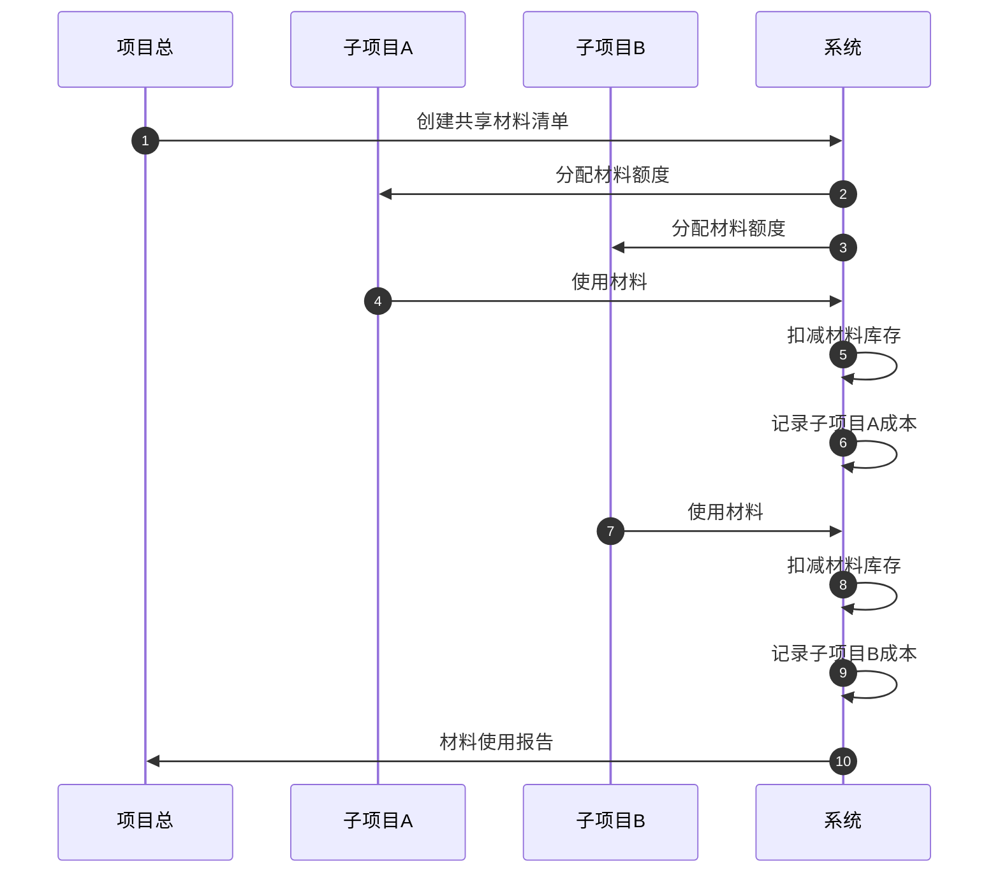

---

### 2.2 跨合同验收机制

#### 2.2.1 验收人配置规则

**配置维度**：

| 配置项 | 说明 | 示例 |
|--------|------|------|
| 默认验收人 | 任务所属合同的甲方或指定人员 | 水电合同→平台指定人员 |
| 跨合同验收人 | 非本合同人员，但有验收权限 | 监理（主合同人员） |
| 验收权限来源 | 项目层级权限、合同层级权限、任务指定权限 | 项目总对子项目任务有验收权 |

**配置模型**：

```sql
CREATE TABLE acceptor_config (
    id BIGINT PRIMARY KEY,
    task_id BIGINT COMMENT '任务ID',
    project_id BIGINT COMMENT '项目ID',
    contract_id BIGINT COMMENT '合同ID',
    
    -- 验收人信息
    acceptor_id BIGINT NOT NULL COMMENT '验收人ID',
    acceptor_type TINYINT COMMENT '类型：1-合同内人员 2-跨合同人员',
    
    -- 权限来源
    permission_source VARCHAR(50) COMMENT '权限来源：project_level/contract_level/task_assign',
    
    -- 验收顺序
    accept_order INT COMMENT '验收顺序：1-第一验收人 2-第二验收人',
    
    create_time DATETIME DEFAULT CURRENT_TIMESTAMP,
    
    INDEX idx_task_id (task_id),
    INDEX idx_acceptor_id (acceptor_id)
) COMMENT='验收人配置表';
```

#### 2.2.2 验收权限传递机制

**权限传递规则**：

```
规则1：项目层级权限向下传递
主项目负责人 → 对所有子项目任务有验收权

规则2：合同层级权限不传递
子合同甲方 → 仅对本合同任务有验收权

规则3：任务指定权限优先
任务指定的验收人 → 优先于层级权限
```

**权限传递图**：

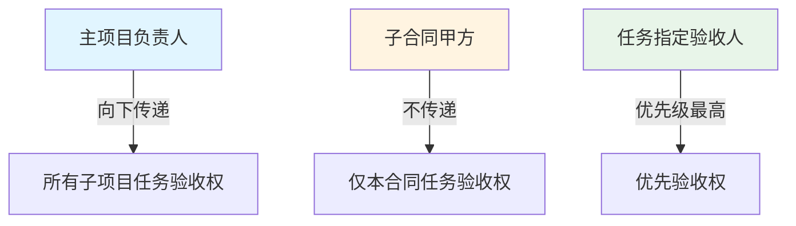

#### 2.2.3 跨合同验收流程

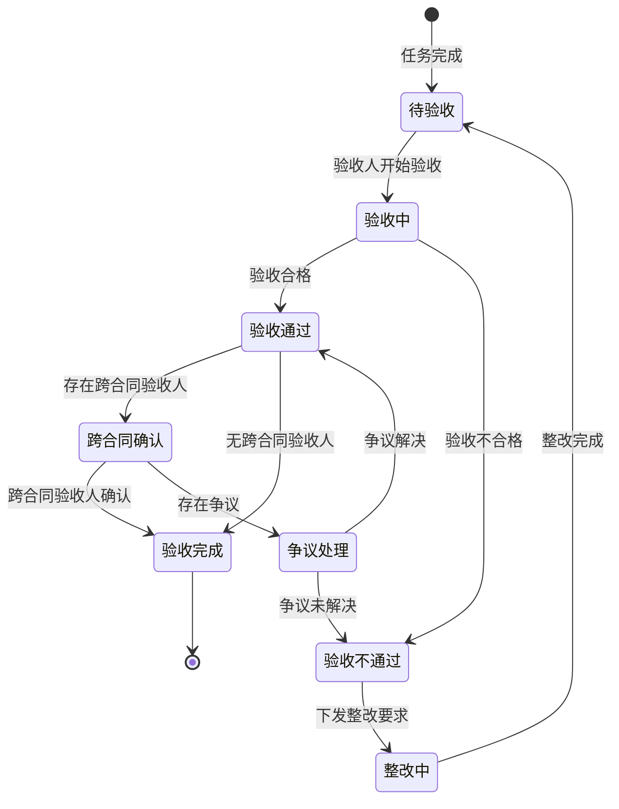

---

### 2.3 跨合同数据可见性

#### 2.3.1 数据权限边界

**数据分类**：

| 数据类型 | 合同内可见 | 跨合同可见 | 说明 |
|----------|------------|------------|------|
| 任务进度 | ✅ | ✅ | 进度数据对上层级可见 |
| 任务详情 | ✅ | 部分 | 敏感信息隔离 |
| 成本数据 | ✅ | ❌ | 成本数据严格隔离 |
| 验收记录 | ✅ | ✅ | 验收记录对上层级可见 |
| 合同金额 | ✅ | ❌ | 合同金额严格隔离 |
| 问题记录 | ✅ | ✅ | 问题记录对上层级可见 |

#### 2.3.2 数据可见性模型

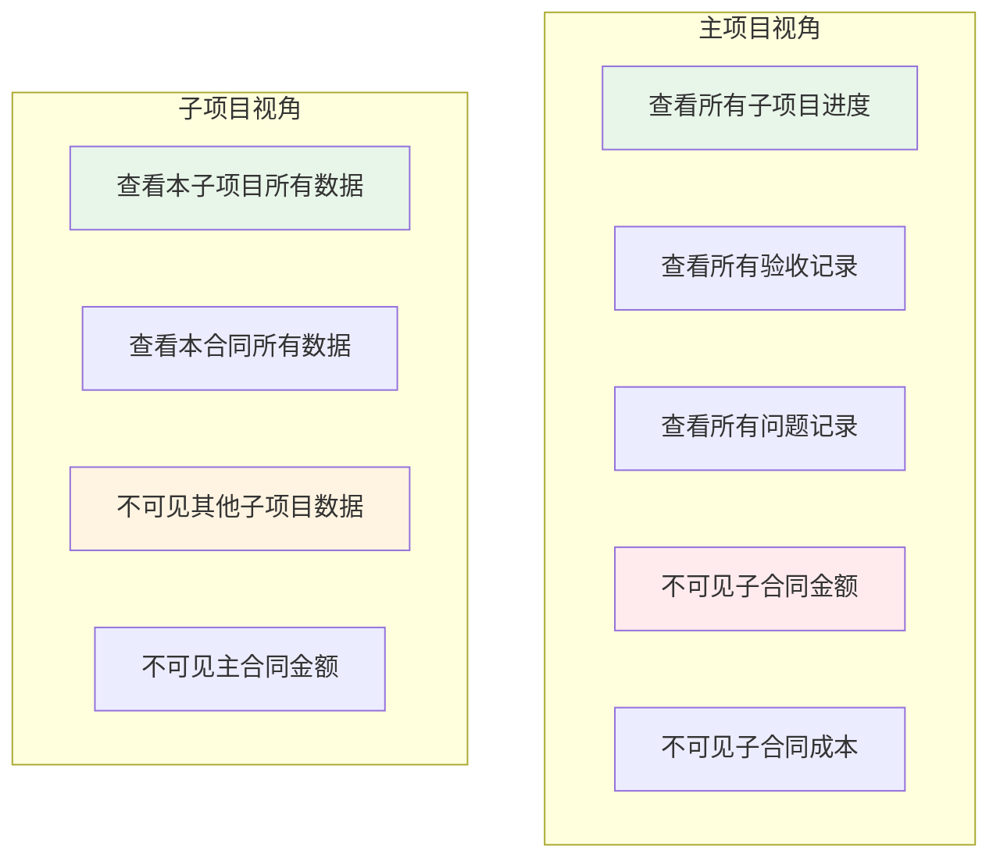

#### 2.3.3 数据权限配置

```sql
CREATE TABLE data_permission (
    id BIGINT PRIMARY KEY,
    user_id BIGINT NOT NULL COMMENT '用户ID',
    project_id BIGINT COMMENT '项目ID',
    contract_id BIGINT COMMENT '合同ID',
    
    -- 权限范围
    scope_type TINYINT COMMENT '范围类型：1-项目级 2-合同级 3-任务级',
    scope_id BIGINT COMMENT '范围ID',
    
    -- 数据权限
    can_view_progress TINYINT DEFAULT 1 COMMENT '可查看进度',
    can_view_cost TINYINT DEFAULT 0 COMMENT '可查看成本',
    can_view_contract TINYINT DEFAULT 0 COMMENT '可查看合同',
    can_view_detail TINYINT DEFAULT 1 COMMENT '可查看详情',
    
    -- 跨合同权限
    can_cross_contract TINYINT DEFAULT 0 COMMENT '可跨合同查看',
    
    create_time DATETIME DEFAULT CURRENT_TIMESTAMP,
    
    INDEX idx_user_id (user_id),
    INDEX idx_project_id (project_id)
) COMMENT='数据权限表';
```

---

## 三、项目维度核心模块设计

### 3.1 项目数据看板设计

#### 3.1.1 多层级数据看板架构

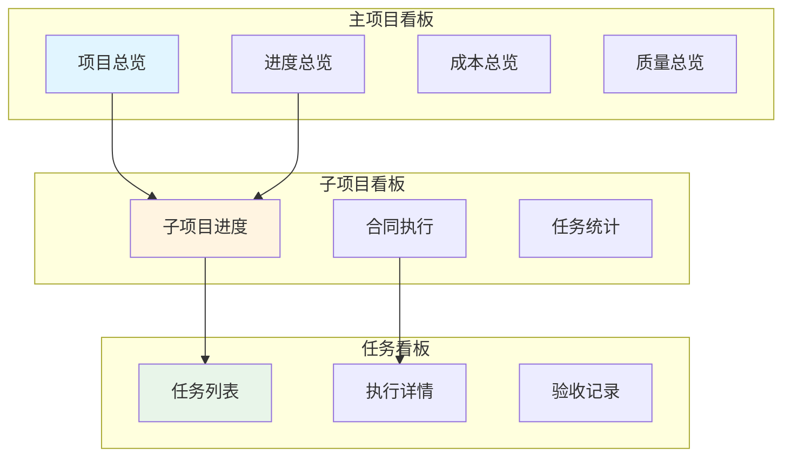

#### 3.1.2 关键指标设计

**进度指标**：

| 指标名称 | 计算方式 | 数据来源 |
|----------|----------|----------|
| 整体进度 | 加权平均所有子项目进度 | 实时计算 |
| 子项目进度 | 加权平均所有任务进度 | 实时计算 |
| 关键路径进度 | 关键任务完成率 | 实时计算 |
| 里程碑达成率 | 已完成里程碑/总里程碑 | 实时计算 |

**成本指标**：

| 指标名称 | 计算方式 | 数据来源 |
|----------|----------|----------|
| 预算执行率 | 已发生成本/预算金额 | 实时计算 |
| 各合同成本占比 | 各合同成本/总成本 | 实时计算 |
| 成本预警 | 超预算百分比 | 实时计算 |

**质量指标**：

| 指标名称 | 计算方式 | 数据来源 |
|----------|----------|----------|
| 验收通过率 | 通过任务数/总任务数 | 实时计算 |
| 一次验收通过率 | 一次通过任务数/总任务数 | 实时计算 |
| 问题数量 | 问题总数 | 实时计算 |
| 整改率 | 已整改问题/总问题 | 实时计算 |

#### 3.1.3 数据穿透能力

**穿透路径**：

```
主项目看板 → 点击子项目进度 → 子项目看板
子项目看板 → 点击合同执行 → 合同详情
合同详情 → 点击任务统计 → 任务列表
任务列表 → 点击任务 → 任务详情
```

**穿透示例**：

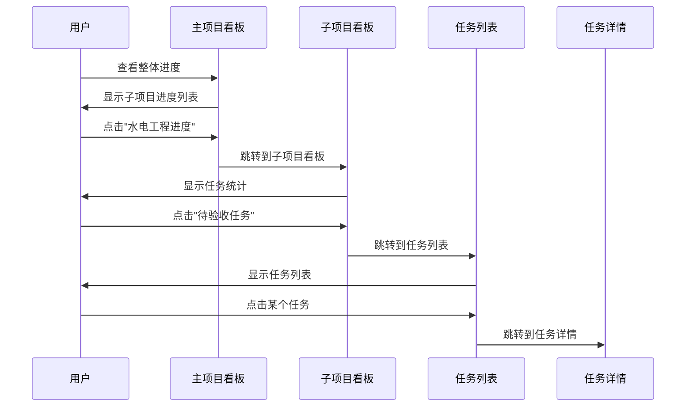

#### 3.1.4 看板数据模型

```sql
CREATE TABLE dashboard_data (
    id BIGINT PRIMARY KEY,
    project_id BIGINT NOT NULL COMMENT '项目ID',
    data_type VARCHAR(50) COMMENT '数据类型：progress/cost/quality',
    
    -- 进度数据
    overall_progress INT COMMENT '整体进度',
    sub_project_progress JSON COMMENT '子项目进度JSON',
    milestone_progress INT COMMENT '里程碑进度',
    
    -- 成本数据
    budget_execution_rate DECIMAL(5,2) COMMENT '预算执行率',
    contract_cost_ratio JSON COMMENT '合同成本占比JSON',
    
    -- 质量数据
    accept_pass_rate DECIMAL(5,2) COMMENT '验收通过率',
    issue_count INT COMMENT '问题数量',
    rectify_rate DECIMAL(5,2) COMMENT '整改率',
    
    -- 时间戳
    calculate_time DATETIME COMMENT '计算时间',
    create_time DATETIME DEFAULT CURRENT_TIMESTAMP,
    
    INDEX idx_project_id (project_id),
    INDEX idx_calculate_time (calculate_time)
) COMMENT='看板数据表';
```

---

### 3.2 项目权限体系设计

#### 3.2.1 权限层级模型

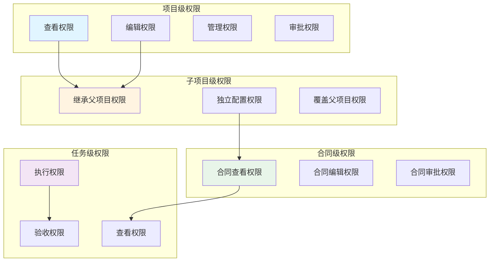

#### 3.2.2 权限继承机制

**继承规则**：

```
规则1：默认继承
子项目成员默认继承父项目的权限

规则2：权限叠加
子项目权限 = 父项目权限 + 子项目独立权限

规则3：权限覆盖
子项目可覆盖父项目的某些权限

规则4：权限回收
父项目可回收子项目的某些权限
```

**继承示例**：

| 角色 | 主项目权限 | 子项目权限（继承） | 子项目权限（独立） | 最终权限 |
|------|------------|-------------------|-------------------|----------|
| 项目总 | 管理、审批 | 管理、审批 | - | 管理、审批 |
| 子项目负责人 | - | 查看、编辑 | 管理 | 查看、编辑、管理 |
| 监理 | 审批 | 审批 | - | 审批 |
| 施工人员 | - | - | 执行 | 执行 |

#### 3.2.3 权限配置模型

```sql
CREATE TABLE permission_hierarchy (
    id BIGINT PRIMARY KEY,
    user_id BIGINT NOT NULL COMMENT '用户ID',
    project_id BIGINT COMMENT '项目ID',
    
    -- 权限层级
    level TINYINT COMMENT '权限层级：1-项目级 2-子项目级 3-合同级 4-任务级',
    target_id BIGINT COMMENT '目标ID（项目ID/合同ID/任务ID）',
    
    -- 权限类型
    can_view TINYINT DEFAULT 0 COMMENT '可查看',
    can_edit TINYINT DEFAULT 0 COMMENT '可编辑',
    can_manage TINYINT DEFAULT 0 COMMENT '可管理',
    can_approve TINYINT DEFAULT 0 COMMENT '可审批',
    can_execute TINYINT DEFAULT 0 COMMENT '可执行',
    can_accept TINYINT DEFAULT 0 COMMENT '可验收',
    
    -- 继承关系
    inherit_from_id BIGINT COMMENT '继承自哪个权限ID',
    is_override TINYINT DEFAULT 0 COMMENT '是否覆盖父权限',
    
    create_time DATETIME DEFAULT CURRENT_TIMESTAMP,
    update_time DATETIME DEFAULT CURRENT_TIMESTAMP ON UPDATE CURRENT_TIMESTAMP,
    
    INDEX idx_user_id (user_id),
    INDEX idx_project_id (project_id),
    INDEX idx_target_id (target_id)
) COMMENT='权限层级表';
```

---

### 3.3 项目资料库设计

#### 3.3.1 资料分类体系

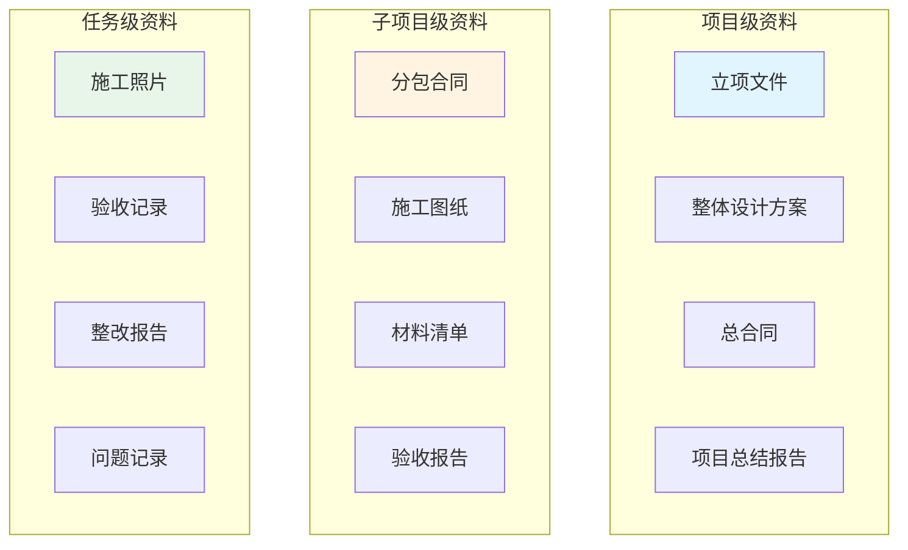

#### 3.3.2 资料权限控制

**权限规则**：

| 资料类型 | 项目负责人 | 子项目负责人 | 合同相关人员 | 其他人员 |
|----------|------------|--------------|--------------|----------|
| 项目级资料 | 查看、编辑、删除 | 查看 | 查看 | 不可见 |
| 子项目级资料 | 查看 | 查看、编辑、删除 | 查看 | 不可见 |
| 任务级资料 | 查看 | 查看 | 查看、编辑、删除 | 不可见 |

#### 3.3.3 资料版本管理

**版本管理机制**：

```
版本号规则：v1.0, v1.1, v2.0

版本变更类型：
- 大版本变更（v1.0 → v2.0）：重大变更，如设计变更
- 小版本变更（v1.0 → v1.1）：小范围修改

版本追溯：
- 保留所有历史版本
- 记录变更原因、变更人、变更时间
- 支持版本对比
```

#### 3.3.4 资料数据模型

```sql
CREATE TABLE document_hierarchy (
    id BIGINT PRIMARY KEY,
    document_name VARCHAR(200) NOT NULL COMMENT '资料名称',
    document_type TINYINT COMMENT '资料类型：1-项目级 2-子项目级 3-任务级',
    
    -- 关联对象
    project_id BIGINT COMMENT '关联项目ID',
    contract_id BIGINT COMMENT '关联合同ID',
    task_id BIGINT COMMENT '关联任务ID',
    
    -- 文件信息
    file_url VARCHAR(500) COMMENT '文件URL',
    file_size BIGINT COMMENT '文件大小',
    file_format VARCHAR(20) COMMENT '文件格式',
    
    -- 版本信息
    version_no VARCHAR(20) DEFAULT 'v1.0' COMMENT '版本号',
    parent_id BIGINT COMMENT '父版本ID',
    change_reason TEXT COMMENT '变更原因',
    
    -- 权限控制
    view_permission TINYINT COMMENT '查看权限：1-项目级 2-子项目级 3-合同级 4-任务级',
    edit_permission TINYINT COMMENT '编辑权限',
    
    -- 上传人
    uploader_id BIGINT COMMENT '上传人ID',
    upload_time DATETIME COMMENT '上传时间',
    
    create_time DATETIME DEFAULT CURRENT_TIMESTAMP,
    update_time DATETIME DEFAULT CURRENT_TIMESTAMP ON UPDATE CURRENT_TIMESTAMP,
    is_deleted TINYINT DEFAULT 0,
    
    INDEX idx_project_id (project_id),
    INDEX idx_contract_id (contract_id),
    INDEX idx_task_id (task_id)
) COMMENT='资料层级表';
```

---

## 四、产品架构思路

### 4.1 整体架构理念

#### 4.1.1 层级化架构

**核心理念**：以项目树为核心，合同树和任务树依附于项目树

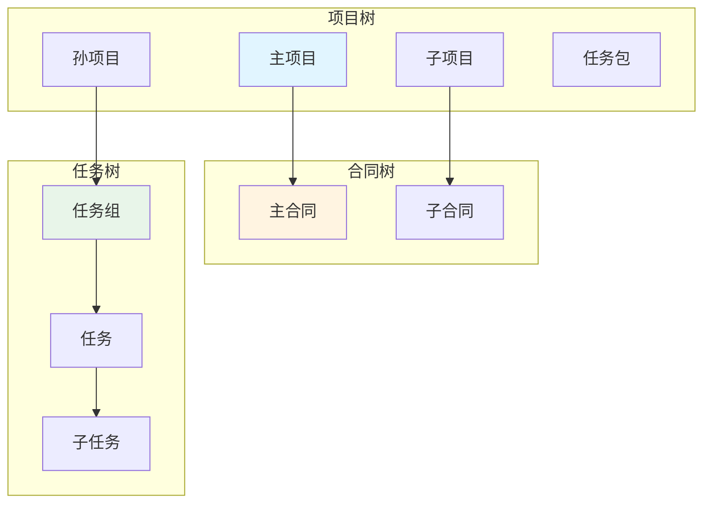

#### 4.1.2 模块化设计

**模块划分**：

```
核心模块：
├── 项目管理模块
│   ├── 项目创建
│   ├── 项目分解
│   ├── 项目进度
│   └── 项目归档
├── 合同管理模块
│   ├── 合同模板
│   ├── 合同签署
│   ├── 合同执行
│   └── 合同结算
├── 任务管理模块
│   ├── 任务分解
│   ├── 任务分配
│   ├── 任务执行
│   └── 任务验收
├── 权限管理模块
│   ├── 角色管理
│   ├── 权限配置
│   ├── 权限继承
│   └── 权限审计
├── 数据看板模块
│   ├── 进度看板
│   ├── 成本看板
│   ├── 质量看板
│   └── 数据穿透
└── 资料库模块
    ├── 资料上传
    ├── 资料分类
    ├── 资料权限
    └── 版本管理
```

#### 4.1.3 数据驱动

**数据流向**：

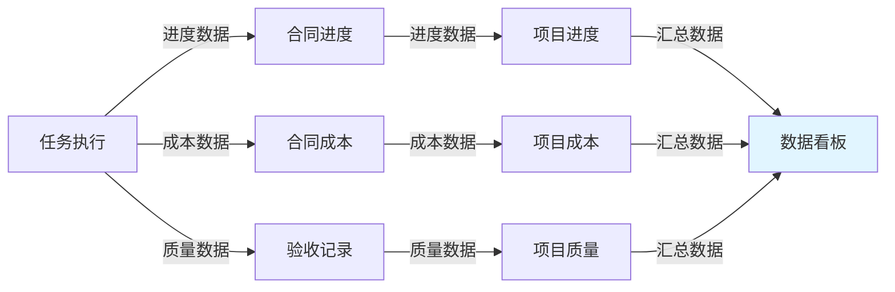

---

### 4.2 核心设计原则

#### 4.2.1 灵活性原则

**体现**：
- 支持不同规模项目的层级分解（1-4层）
- 支持不同业务场景的合同配置
- 支持灵活的权限配置和继承

#### 4.2.2 独立性原则

**体现**：
- 各层级合同独立签署、独立结算
- 各子项目可独立管理、独立统计
- 各任务可独立执行、独立验收

#### 4.2.3 协同性原则

**体现**：
- 跨合同验收机制
- 跨层级数据共享
- 跨模块消息通知

#### 4.2.4 透明性原则

**体现**：
- 项目全流程数据透明
- 合同执行过程透明
- 任务验收记录透明

#### 4.2.5 扩展性原则

**体现**：
- 支持未来业务场景扩展
- 支持新模块接入
- 支持第三方系统集成

---

### 4.3 技术架构建议

#### 4.3.1 数据模型

**树状结构存储**：
- 使用 `parent_id` 和 `path` 字段存储层级关系
- 使用 `root_id` 快速查询整个项目树
- 使用递归查询获取所有子项目

#### 4.3.2 权限模型

**RBAC + 数据权限组合**：
- RBAC：基于角色的访问控制
- 数据权限：基于数据范围的访问控制
- 组合：角色 + 数据范围 = 最终权限

#### 4.3.3 数据汇总

**实时计算策略**：
- 初期版本：实时计算所有汇总数据
- 优化方案：引入缓存机制，定时刷新
- 长期方案：预计算 + 实时更新

---

## 五、产品优势分析

### 5.1 相比传统方案的优势

#### 5.1.1 多层级合同管理

| 对比维度 | 传统方案 | 本平台 |
|----------|----------|--------|
| 合同层级 | 单一合同或合同间无关联 | 层级化合同管理 |
| 合同关系 | 独立管理，无关联 | 主合同与子合同关联 |
| 金额汇总 | 手工统计 | 自动汇总 |
| 适用场景 | 简单项目 | 复杂项目、分包项目 |

#### 5.1.2 跨合同协作

| 对比维度 | 传统方案 | 本平台 |
|----------|----------|--------|
| 协作方式 | 线下沟通，效率低 | 线上协作，效率高 |
| 验收机制 | 各合同独立验收 | 跨合同验收支持 |
| 数据共享 | 不支持 | 支持跨合同数据共享 |
| 争议处理 | 线下协商 | 线上争议处理流程 |

#### 5.1.3 数据穿透能力

| 对比维度 | 传统方案 | 本平台 |
|----------|----------|--------|
| 数据层级 | 各层级数据割裂 | 数据逐层穿透 |
| 查询方式 | 多次查询 | 一键穿透 |
| 数据关联 | 无关联 | 自动关联 |
| 分析能力 | 弱 | 强 |

#### 5.1.4 权限精细化

| 对比维度 | 传统方案 | 本平台 |
|----------|----------|--------|
| 权限粒度 | 粗粒度（项目级） | 细粒度（任务级） |
| 权限继承 | 不支持 | 支持多层级继承 |
| 权限覆盖 | 不支持 | 支持子层级覆盖 |
| 跨合同权限 | 不支持 | 支持 |

---

### 5.2 核心竞争力

#### 5.2.1 业务适配性强

- **家装场景**：整体装修 → 水电/泥瓦/木工等子项目
- **工装场景**：整体工程 → 设计/施工/装修等阶段
- **工程项目**：总包项目 → 分包项目 → 专业分包

#### 5.2.2 管理颗粒度细

- **项目级**：整体进度、成本、质量
- **合同级**：合同执行、付款、结算
- **任务级**：任务执行、验收、整改

#### 5.2.3 协作效率高

- **跨合同验收**：主合同人员可验收子合同任务
- **跨层级协作**：上下层级数据实时同步
- **跨模块联动**：任务→合同→项目数据联动

#### 5.2.4 数据价值大

- **多维度数据**：进度、成本、质量、时间
- **多层级数据**：项目、合同、任务
- **数据穿透**：从汇总到明细的快速定位

---

## 六、用户体验方向

### 6.1 用户体验设计原则

#### 6.1.1 简洁性原则

**设计要点**：
- 复杂业务简单化呈现
- 层级关系可视化展示
- 关键信息突出显示

**实现方式**：
- 使用树状图展示项目层级
- 使用进度条展示任务进度
- 使用颜色区分不同状态

#### 6.1.2 引导性原则

**设计要点**：
- 智能引导用户完成操作
- 关键节点提醒
- 错误提示友好

**实现方式**：
- 新手引导流程
- 关键节点自动提醒
- 操作错误智能提示

#### 6.1.3 可视化原则

**设计要点**：
- 数据可视化
- 进度可视化
- 关系可视化

**实现方式**：
- 使用图表展示数据
- 使用甘特图展示进度
- 使用关系图展示层级

#### 6.1.4 移动化原则

**设计要点**：
- 移动端优先
- 随时随地管理
- 便捷操作

**实现方式**：
- 响应式设计
- 移动端专属功能（拍照、语音）
- 离线操作支持

---

### 6.2 关键体验设计

#### 6.2.1 项目全景视图

**设计目标**：一屏查看项目整体状况

**设计内容**：
- 项目层级树状图
- 各子项目进度条
- 关键里程碑标记
- 预警信息提示

**交互设计**：
- 点击子项目可展开查看详情
- 拖拽调整项目层级
- 右键菜单快速操作

#### 6.2.2 智能预警提醒

**设计目标**：自动识别异常，及时提醒

**预警类型**：
- 进度预警：任务延期、项目延期
- 成本预警：超预算、成本异常
- 质量预警：验收不通过、问题频发
- 时间预警：里程碑延期、合同到期

**提醒方式**：
- 系统消息
- 短信提醒
- 微信推送

#### 6.2.3 一键穿透查询

**设计目标**：从汇总数据快速定位到明细

**穿透路径**：
```
项目看板 → 子项目看板 → 合同详情 → 任务列表 → 任务详情
```

**交互设计**：
- 点击进度条跳转到子项目看板
- 点击合同名称跳转到合同详情
- 点击任务数量跳转到任务列表

#### 6.2.4 移动端便捷操作

**设计目标**：随时随地管理项目

**核心功能**：
- 拍照上传：施工照片、验收照片
- 语音录入：任务汇报、问题描述
- 扫码验收：扫描二维码快速验收
- 离线操作：无网络时也可操作

---

### 6.3 用户旅程优化

#### 6.3.1 项目发起人旅程

**核心需求**：快速创建项目、便捷分解子项目、灵活配置权限

**优化设计**：

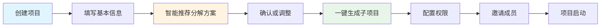

#### 6.3.2 合同签署方旅程

**核心需求**：清晰查看合同范围、便捷签署、实时查看进度

**优化设计**：

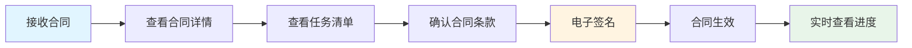

#### 6.3.3 任务执行人旅程

**核心需求**：明确任务要求、便捷汇报进度、快速申请验收

**优化设计**：

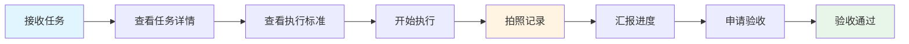

#### 6.3.4 验收确认人旅程

**核心需求**：及时收到通知、便捷查看详情、快速确认验收

**优化设计**：


---

## 七、商业化方向

### 7.1 商业模式设计

#### 7.1.1 初期阶段：业务运营模式跑通

**核心目标**：验证商业模式，积累用户和数据

**运营策略**：
- 免费使用，快速获客
- 聚焦家装市场，建立标杆案例
- 完善产品功能，提升用户粘性

**收入来源**：
- 增值服务：数据分析报告、专家咨询
- 广告收入：材料商、服务商广告

#### 7.1.2 中期阶段：SaaS订阅模式

**版本设计**：

| 版本 | 价格 | 功能 | 适用对象 |
|------|------|------|----------|
| 基础版 | 免费 | 基础功能，限制项目数量 | 个人用户、小型项目 |
| 专业版 | 99元/月 | 完整功能，不限项目数量 | 中小型企业 |
| 企业版 | 299元/月 | 高级功能 + 私有化部署 | 大型企业 |

**收费策略**：
- 按项目数量收费
- 按用户数量收费
- 按存储空间收费

#### 7.1.3 长期阶段：生态平台模式

**生态构建**：
- 设计师平台：设计师入驻，提供设计服务
- 施工方平台：施工队入驻，提供施工服务
- 材料商平台：材料商入驻，提供材料供应

**收入来源**：
- 交易佣金：平台担保交易，收取佣金
- 金融服务：供应链金融、保险服务
- 数据服务：行业数据分析报告

---

### 7.2 商业化路径规划

#### 7.2.1 第一阶段（1-2年）：验证期

**目标**：
- 积累10万+用户
- 完成1000+项目
- 建立品牌认知

**策略**：
- 免费使用，快速获客
- 聚焦家装市场
- 建立标杆案例

#### 7.2.2 第二阶段（2-3年）：成长期

**目标**：
- 实现100万+营收
- 拓展工装市场
- 构建服务生态

**策略**：
- 推出付费版本
- 拓展市场范围
- 引入第三方服务商

#### 7.2.3 第三阶段（3-5年）：成熟期

**目标**：
- 实现1000万+营收
- 成为行业领先平台
- 构建完整生态

**策略**：
- 数据变现
- 金融服务
- 生态平台

---

### 7.3 竞争壁垒构建

#### 7.3.1 数据壁垒

**构建方式**：
- 积累项目数据：项目数量、项目类型、项目规模
- 积累用户数据：用户行为、用户偏好、用户关系
- 积累行业数据：行业趋势、行业标杆、行业洞察

#### 7.3.2 网络效应

**构建方式**：
- 连接业主：项目发起方
- 连接服务商：项目执行方
- 连接施工方：任务执行方
- 连接材料商：材料供应方

#### 7.3.3 品牌壁垒

**构建方式**：
- 打造"透明家装"品牌认知
- 建立行业标杆案例
- 提供优质用户体验

#### 7.3.4 技术壁垒

**构建方式**：
- 多层级架构技术
- 跨合同协作技术
- 数据穿透技术
- 权限精细化技术

---

## 八、总结

### 8.1 核心创新点

1. **多层级项目架构**：支持项目→子项目→孙项目→任务包的4层分解
2. **独立合同签订**：每个层级可独立签订合同，独立结算
3. **跨合同协作**：支持跨合同验收、跨合同数据共享
4. **数据穿透**：从项目看板→子项目→合同→任务的逐层穿透
5. **权限精细化**：多维度、多粒度的权限控制体系

### 8.2 核心价值

1. **提升管理效率**：层级化管理，清晰明确
2. **降低协作成本**：跨合同协作，高效便捷
3. **增强数据价值**：多维度数据，深度洞察
4. **保障项目质量**：精细化权限，全程透明

### 8.3 实施建议

1. **分阶段实施**：先核心功能，后增值功能
2. **快速迭代**：小步快跑，快速验证
3. **用户导向**：以用户体验为核心
4. **数据驱动**：以数据指导产品优化

---

## 附录：Mermaid流程图汇总

### A.1 项目层级架构图


### A.2 合同层级关系图

```mermaid
graph TD
    subgraph 项目层级
        A[主项目]
        B[子项目]
        C[子项目]
    end
    
    subgraph 合同层级
        CA[主合同]
        CB[子合同1]
        CC[子合同2]
    end
    
    A -.-> CA
    B -.-> CB
    C -.-> CC
    
    CB --> CA
    CC --> CA
```

### A.3 跨合同验收流程图

```mermaid
sequenceDiagram
    autonumber
    participant 施工方
    participant 系统
    participant 监理
    participant 业主
    
    施工方->>系统: 完成任务，申请验收
    系统->>监理: 发送验收通知（跨合同）
    监理->>系统: 现场验收，填写验收单
    监理->>系统: 验收通过，签字确认
    系统->>业主: 验收完成通知
    系统->>施工方: 验收通过通知
    系统->>系统: 触发付款流程
```

### A.4 权限层级模型图

```mermaid
graph TB
    subgraph 项目级权限
        A1[查看权限]
        A2[编辑权限]
        A3[管理权限]
        A4[审批权限]
    end
    
    subgraph 子项目级权限
        B1[继承父项目权限]
        B2[独立配置权限]
    end
    
    subgraph 任务级权限
        C1[执行权限]
        C2[验收权限]
    end
    
    A1 --> B1
    B1 --> C1
```

### A.5 商业化路径图

```mermaid
graph LR
    A[第一阶段<br/>验证期<br/>1-2年] --> B[第二阶段<br/>成长期<br/>2-3年]
    B --> C[第三阶段<br/>成熟期<br/>3-5年]
    
    A --> A1[免费使用<br/>快速获客]
    B --> B1[付费版本<br/>商业变现]
    C --> C1[生态平台<br/>数据变现]
    
    style A fill:#e1f5ff
    style B fill:#fff4e1
    style C fill:#e8f5e9
```
