# 全透明家装平台 - Mermaid流程图代码

## 使用说明

### 方式一：在线预览
1. 打开 [Mermaid Live Editor](https://mermaid.live/)
2. 复制下方代码粘贴即可实时预览

### 方式二：VS Code预览
1. 安装插件：Markdown Preview Mermaid Support
2. 在Markdown文件中直接预览

### 方式三：ProcessOn导入
1. 登录 ProcessOn
2. 选择"更多图形" → "Mermaid"
3. 粘贴代码即可生成

---

## 一、项目创建流程（泳道图）

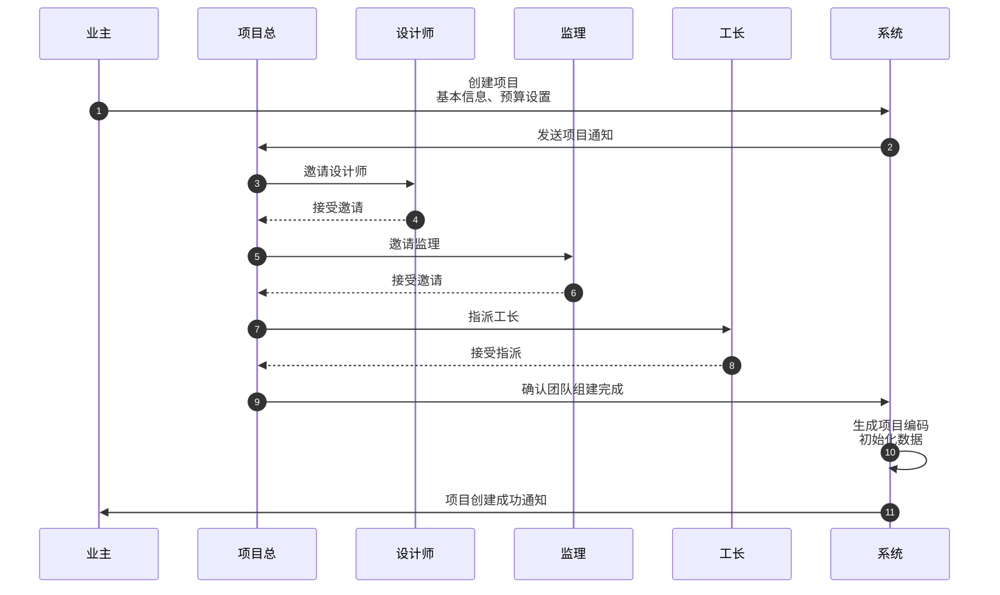
```mermaid
sequenceDiagram
    autonumber
    participant 业主
    participant 项目总
    participant 设计师
    participant 监理
    participant 工长
    participant 系统

    业主->>系统: 创建项目<br/>基本信息、预算设置
    系统->>项目总: 发送项目通知
    
    项目总->>设计师: 邀请设计师
    设计师-->>项目总: 接受邀请
    
    项目总->>监理: 邀请监理
    监理-->>项目总: 接受邀请
    
    项目总->>工长: 指派工长
    工长-->>项目总: 接受指派
    
    项目总->>系统: 确认团队组建完成
    系统->>系统: 生成项目编码<br/>初始化数据
    系统->>业主: 项目创建成功通知
```

---

## 二、项目架构分解流程（泳道图）

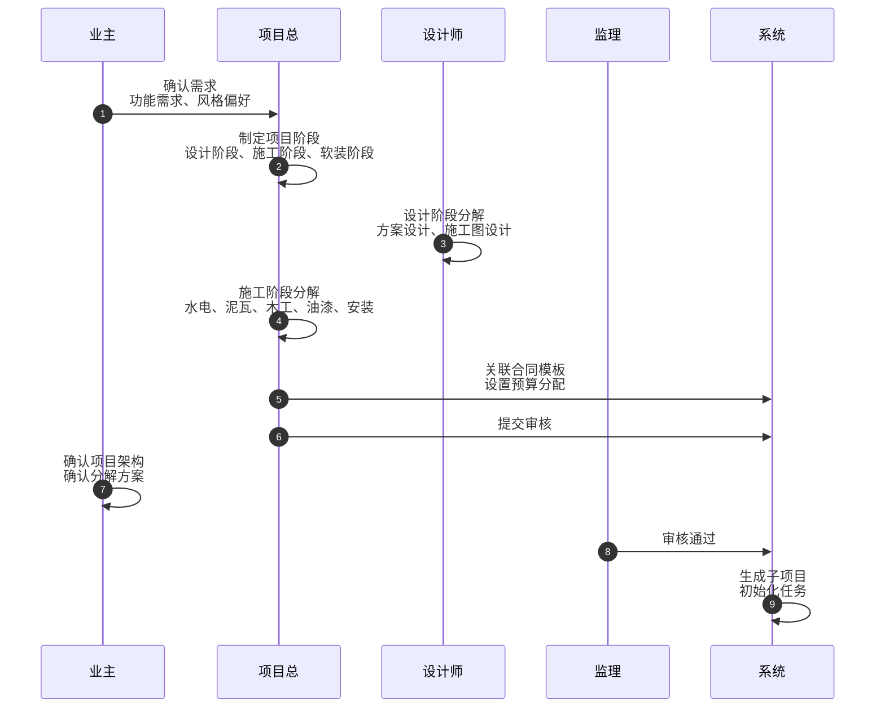
```mermaid
sequenceDiagram
    autonumber
    participant 业主
    participant 项目总
    participant 设计师
    participant 监理
    participant 系统

    业主->>项目总: 确认需求<br/>功能需求、风格偏好
    
    项目总->>项目总: 制定项目阶段<br/>设计阶段、施工阶段、软装阶段
    
    设计师->>设计师: 设计阶段分解<br/>方案设计、施工图设计
    
    项目总->>项目总: 施工阶段分解<br/>水电、泥瓦、木工、油漆、安装
    
    项目总->>系统: 关联合同模板<br/>设置预算分配
    项目总->>系统: 提交审核
    
    业主->>业主: 确认项目架构<br/>确认分解方案
    
    监理->>系统: 审核通过
    系统->>系统: 生成子项目<br/>初始化任务
```

---

## 三、合同签订流程（泳道图）

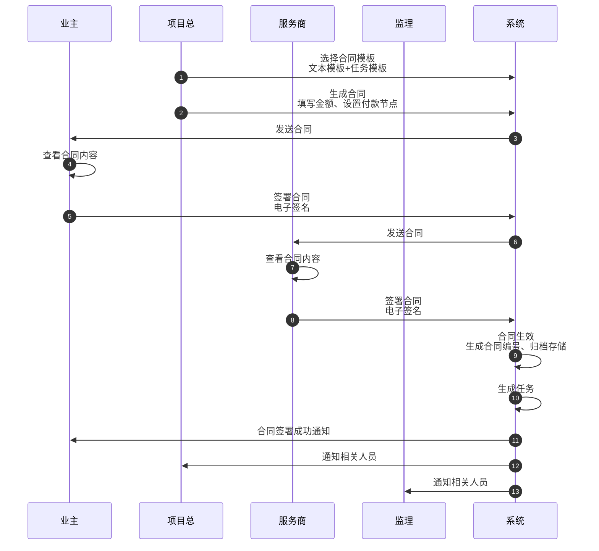
```mermaid
sequenceDiagram
    autonumber
    participant 业主
    participant 项目总
    participant 服务商
    participant 监理
    participant 系统

    项目总->>系统: 选择合同模板<br/>文本模板+任务模板
    项目总->>系统: 生成合同<br/>填写金额、设置付款节点
    系统->>业主: 发送合同
    
    业主->>业主: 查看合同内容
    业主->>系统: 签署合同<br/>电子签名
    
    系统->>服务商: 发送合同
    服务商->>服务商: 查看合同内容
    服务商->>系统: 签署合同<br/>电子签名
    
    系统->>系统: 合同生效<br/>生成合同编号、归档存储
    系统->>系统: 生成任务
    
    系统->>业主: 合同签署成功通知
    系统->>项目总: 通知相关人员
    系统->>监理: 通知相关人员
```

---

## 四、任务分配与执行流程（泳道图）

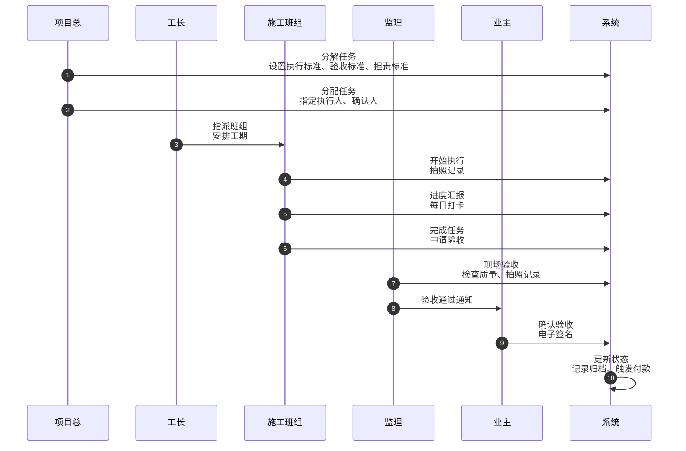
```mermaid
sequenceDiagram
    autonumber
    participant 项目总
    participant 工长
    participant 施工班组
    participant 监理
    participant 业主
    participant 系统

    项目总->>系统: 分解任务<br/>设置执行标准、验收标准、担责标准
    项目总->>系统: 分配任务<br/>指定执行人、确认人
    
    工长->>施工班组: 指派班组<br/>安排工期
    
    施工班组->>系统: 开始执行<br/>拍照记录
    施工班组->>系统: 进度汇报<br/>每日打卡
    施工班组->>系统: 完成任务<br/>申请验收
    
    监理->>系统: 现场验收<br/>检查质量、拍照记录
    监理->>业主: 验收通过通知
    
    业主->>系统: 确认验收<br/>电子签名
    
    系统->>系统: 更新状态<br/>记录归档、触发付款
```

---

## 五、验收与付款流程（泳道图）

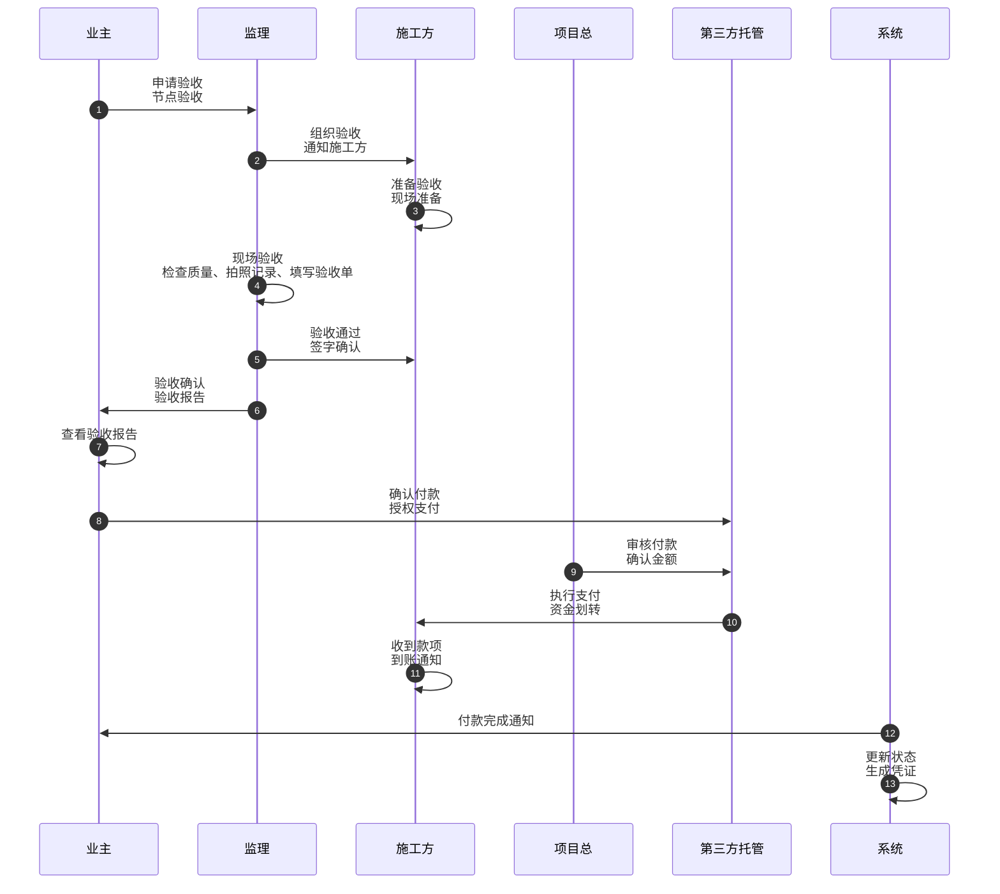
```mermaid
sequenceDiagram
    autonumber
    participant 业主
    participant 监理
    participant 施工方
    participant 项目总
    participant 第三方托管
    participant 系统

    业主->>监理: 申请验收<br/>节点验收
    
    监理->>施工方: 组织验收<br/>通知施工方
    施工方->>施工方: 准备验收<br/>现场准备
    
    监理->>监理: 现场验收<br/>检查质量、拍照记录、填写验收单
    监理->>施工方: 验收通过<br/>签字确认
    
    监理->>业主: 验收确认<br/>验收报告
    业主->>业主: 查看验收报告
    
    业主->>第三方托管: 确认付款<br/>授权支付
    
    项目总->>第三方托管: 审核付款<br/>确认金额
    第三方托管->>施工方: 执行支付<br/>资金划转
    
    施工方->>施工方: 收到款项<br/>到账通知
    
    系统->>业主: 付款完成通知
    系统->>系统: 更新状态<br/>生成凭证
```

---

## 六、项目启动会流程（泳道图）

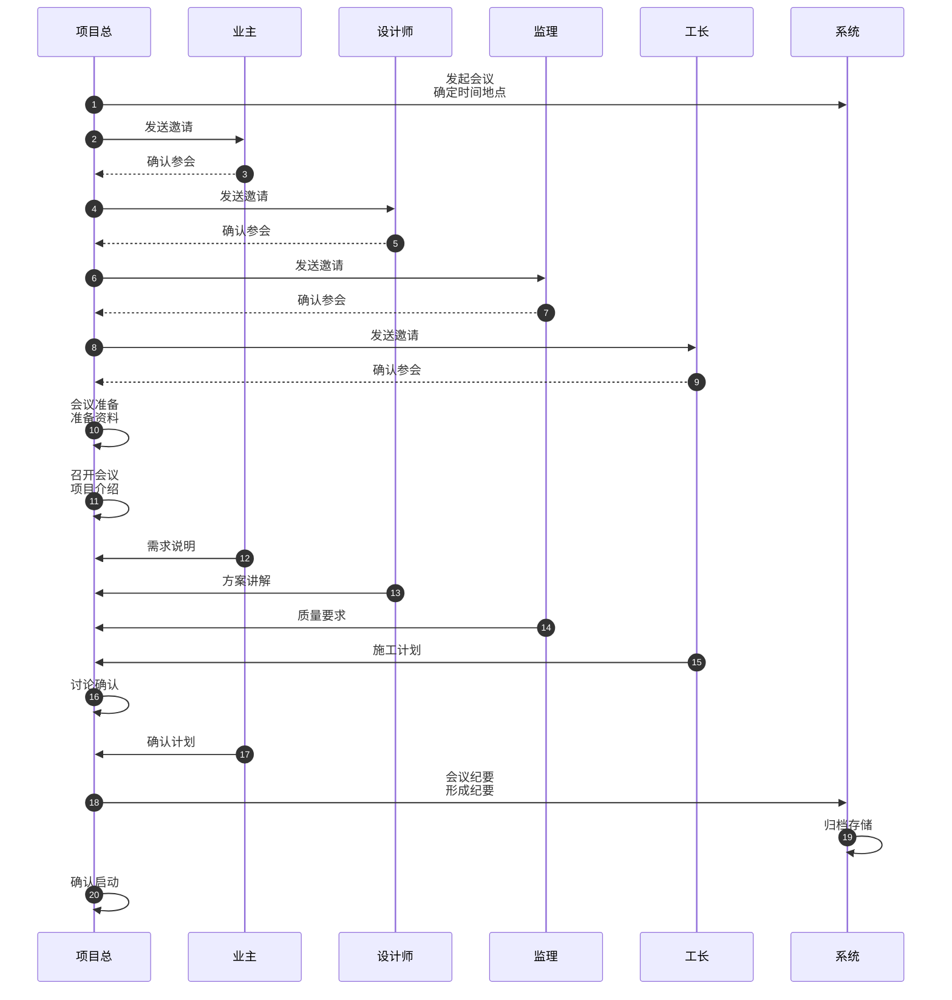
```mermaid
sequenceDiagram
    autonumber
    participant 项目总
    participant 业主
    participant 设计师
    participant 监理
    participant 工长
    participant 系统

    项目总->>系统: 发起会议<br/>确定时间地点
    
    项目总->>业主: 发送邀请
    业主-->>项目总: 确认参会
    
    项目总->>设计师: 发送邀请
    设计师-->>项目总: 确认参会
    
    项目总->>监理: 发送邀请
    监理-->>项目总: 确认参会
    
    项目总->>工长: 发送邀请
    工长-->>项目总: 确认参会
    
    项目总->>项目总: 会议准备<br/>准备资料
    
    项目总->>项目总: 召开会议<br/>项目介绍
    业主->>项目总: 需求说明
    设计师->>项目总: 方案讲解
    监理->>项目总: 质量要求
    工长->>项目总: 施工计划
    
    项目总->>项目总: 讨论确认
    业主->>项目总: 确认计划
    
    项目总->>系统: 会议纪要<br/>形成纪要
    系统->>系统: 归档存储
    
    项目总->>项目总: 确认启动
```

---

## 七、变更管理流程（泳道图）

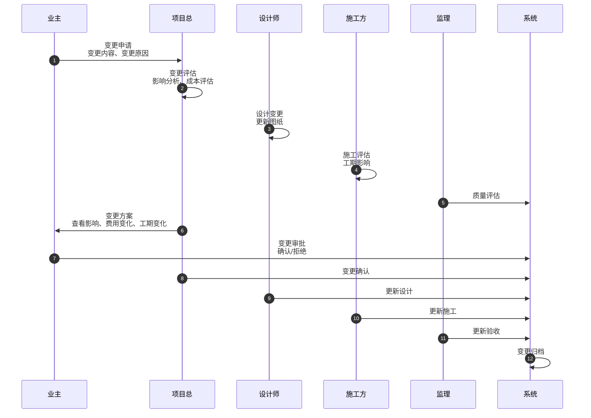
```mermaid
sequenceDiagram
    autonumber
    participant 业主
    participant 项目总
    participant 设计师
    participant 施工方
    participant 监理
    participant 系统

    业主->>项目总: 变更申请<br/>变更内容、变更原因
    
    项目总->>项目总: 变更评估<br/>影响分析、成本评估
    
    设计师->>设计师: 设计变更<br/>更新图纸
    
    施工方->>施工方: 施工评估<br/>工期影响
    
    监理->>系统: 质量评估
    
    项目总->>业主: 变更方案<br/>查看影响、费用变化、工期变化
    
    业主->>系统: 变更审批<br/>确认/拒绝
    
    项目总->>系统: 变更确认
    
    设计师->>系统: 更新设计
    施工方->>系统: 更新施工
    监理->>系统: 更新验收
    
    系统->>系统: 变更归档
```

---

## 八、竣工验收流程（泳道图）

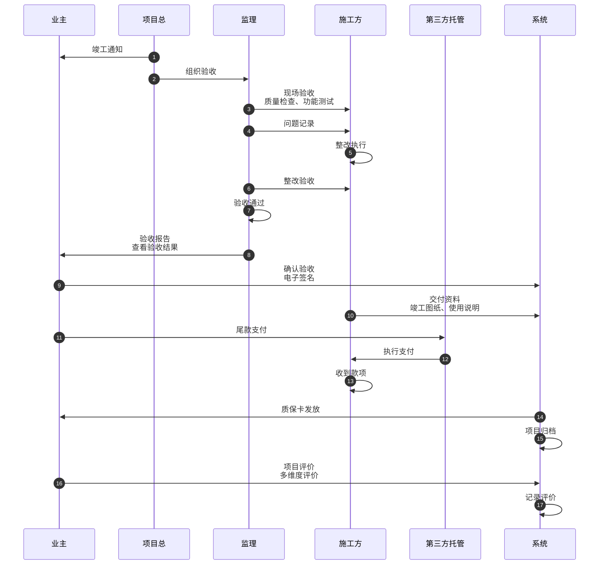
```mermaid
sequenceDiagram
    autonumber
    participant 业主
    participant 项目总
    participant 监理
    participant 施工方
    participant 第三方托管
    participant 系统

    项目总->>业主: 竣工通知
    
    项目总->>监理: 组织验收
    
    监理->>施工方: 现场验收<br/>质量检查、功能测试
    
    监理->>施工方: 问题记录
    施工方->>施工方: 整改执行
    
    监理->>施工方: 整改验收
    监理->>监理: 验收通过
    
    监理->>业主: 验收报告<br/>查看验收结果
    
    业主->>系统: 确认验收<br/>电子签名
    
    施工方->>系统: 交付资料<br/>竣工图纸、使用说明
    
    业主->>第三方托管: 尾款支付
    第三方托管->>施工方: 执行支付
    
    施工方->>施工方: 收到款项
    
    系统->>业主: 质保卡发放
    系统->>系统: 项目归档
    
    业主->>系统: 项目评价<br/>多维度评价
    系统->>系统: 记录评价
```

---

## 九、业主项目发起流程（C端）

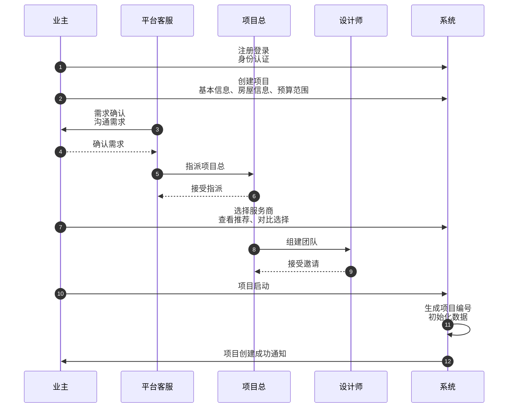
```mermaid
sequenceDiagram
    autonumber
    participant 业主
    participant 平台客服
    participant 项目总
    participant 设计师
    participant 系统

    业主->>系统: 注册登录<br/>身份认证
    业主->>系统: 创建项目<br/>基本信息、房屋信息、预算范围
    
    平台客服->>业主: 需求确认<br/>沟通需求
    业主-->>平台客服: 确认需求
    
    平台客服->>项目总: 指派项目总
    项目总-->>平台客服: 接受指派
    
    业主->>系统: 选择服务商<br/>查看推荐、对比选择
    
    项目总->>设计师: 组建团队
    设计师-->>项目总: 接受邀请
    
    业主->>系统: 项目启动
    系统->>系统: 生成项目编号<br/>初始化数据
    系统->>业主: 项目创建成功通知
```

---

## 十、工长施工管理流程（B端）

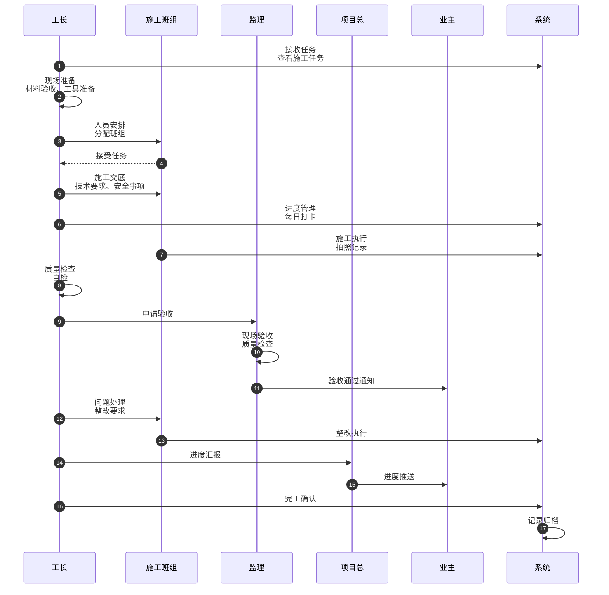
```mermaid
sequenceDiagram
    autonumber
    participant 工长
    participant 施工班组
    participant 监理
    participant 项目总
    participant 业主
    participant 系统

    工长->>系统: 接收任务<br/>查看施工任务
    
    工长->>工长: 现场准备<br/>材料验收、工具准备
    
    工长->>施工班组: 人员安排<br/>分配班组
    施工班组-->>工长: 接受任务
    
    工长->>施工班组: 施工交底<br/>技术要求、安全事项
    
    工长->>系统: 进度管理<br/>每日打卡
    施工班组->>系统: 施工执行<br/>拍照记录
    
    工长->>工长: 质量检查<br/>自检
    
    工长->>监理: 申请验收
    监理->>监理: 现场验收<br/>质量检查
    监理->>业主: 验收通过通知
    
    工长->>施工班组: 问题处理<br/>整改要求
    施工班组->>系统: 整改执行
    
    工长->>项目总: 进度汇报
    项目总->>业主: 进度推送
    
    工长->>系统: 完工确认
    系统->>系统: 记录归档
```

---

## 十一、系统架构图

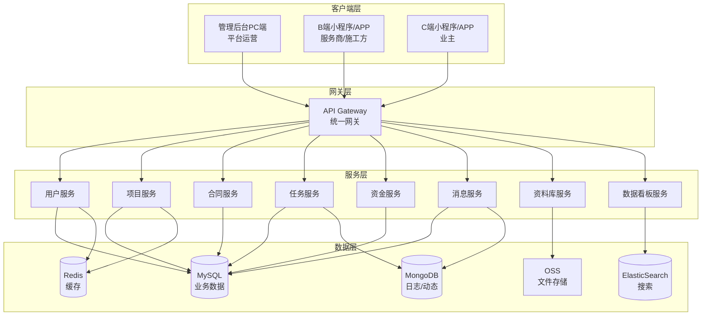
```mermaid
graph TB
    subgraph 客户端层
        A1[管理后台PC端<br/>平台运营]
        A2[B端小程序/APP<br/>服务商/施工方]
        A3[C端小程序/APP<br/>业主]
    end
    
    subgraph 网关层
        B1[API Gateway<br/>统一网关]
    end
    
    subgraph 服务层
        C1[用户服务]
        C2[项目服务]
        C3[合同服务]
        C4[任务服务]
        C5[资金服务]
        C6[消息服务]
        C7[资料库服务]
        C8[数据看板服务]
    end
    
    subgraph 数据层
        D1[(MySQL<br/>业务数据)]
        D2[(Redis<br/>缓存)]
        D3[(MongoDB<br/>日志/动态)]
        D4[(ElasticSearch<br/>搜索)]
        D5[OSS<br/>文件存储]
    end
    
    A1 --> B1
    A2 --> B1
    A3 --> B1
    
    B1 --> C1
    B1 --> C2
    B1 --> C3
    B1 --> C4
    B1 --> C5
    B1 --> C6
    B1 --> C7
    B1 --> C8
    
    C1 --> D1
    C2 --> D1
    C3 --> D1
    C4 --> D1
    C5 --> D1
    C6 --> D1
    C7 --> D5
    C8 --> D4
    
    C1 --> D2
    C2 --> D2
    C4 --> D3
    C6 --> D3
```

---

## 十二、角色关系图

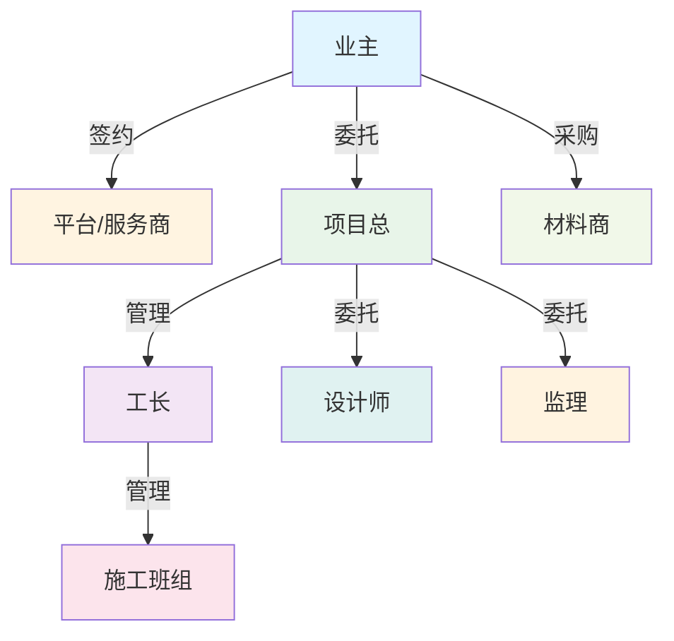
```mermaid
graph TD
    A[业主] -->|签约| B[平台/服务商]
    A -->|委托| C[项目总]
    C -->|管理| D[工长]
    D -->|管理| E[施工班组]
    C -->|委托| F[设计师]
    C -->|委托| G[监理]
    A -->|采购| H[材料商]
    
    style A fill:#e1f5ff
    style B fill:#fff4e1
    style C fill:#e8f5e9
    style D fill:#f3e5f5
    style E fill:#fce4ec
    style F fill:#e0f2f1
    style G fill:#fff3e0
    style H fill:#f1f8e9
```

---

## 十三、项目状态流转图

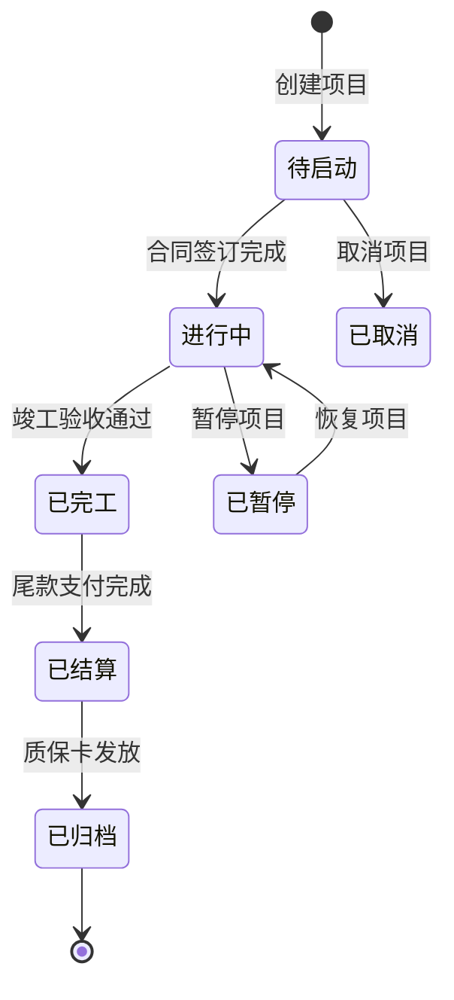
```mermaid
stateDiagram-v2
    [*] --> 待启动: 创建项目
    待启动 --> 进行中: 合同签订完成
    待启动 --> 已取消: 取消项目
    
    进行中 --> 已完工: 竣工验收通过
    进行中 --> 已暂停: 暂停项目
    
    已完工 --> 已结算: 尾款支付完成
    已暂停 --> 进行中: 恢复项目
    
    已结算 --> 已归档: 质保卡发放
    已归档 --> [*]
```

---

## 十四、任务状态流转图

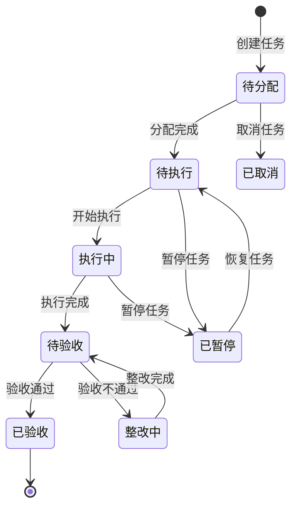
```mermaid
stateDiagram-v2
    [*] --> 待分配: 创建任务
    待分配 --> 待执行: 分配完成
    待分配 --> 已取消: 取消任务
    
    待执行 --> 执行中: 开始执行
    待执行 --> 已暂停: 暂停任务
    
    执行中 --> 待验收: 执行完成
    执行中 --> 已暂停: 暂停任务
    
    待验收 --> 已验收: 验收通过
    待验收 --> 整改中: 验收不通过
    
    整改中 --> 待验收: 整改完成
    已暂停 --> 待执行: 恢复任务
    已验收 --> [*]
```

---

## 十五、核心业务流程总览

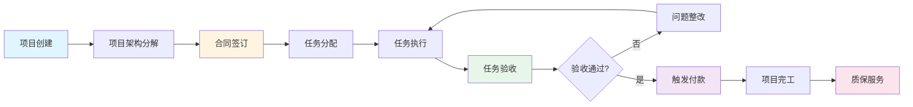
```mermaid
graph LR
    A[项目创建] --> B[项目架构分解]
    B --> C[合同签订]
    C --> D[任务分配]
    D --> E[任务执行]
    E --> F[任务验收]
    F --> G{验收通过?}
    G -->|否| H[问题整改]
    H --> E
    G -->|是| I[触发付款]
    I --> J[项目完工]
    J --> K[质保服务]
    
    style A fill:#e1f5ff
    style C fill:#fff4e1
    style F fill:#e8f5e9
    style I fill:#f3e5f5
    style K fill:#fce4ec
```

---

## 使用建议

### 推荐工具
1. **Mermaid Live Editor** - https://mermaid.live/ （在线编辑，实时预览）
2. **VS Code** - 安装 "Markdown Preview Mermaid Support" 插件
3. **Typora** - 原生支持Mermaid
4. **ProcessOn** - 支持Mermaid语法导入

### 导出格式
在 Mermaid Live Editor 中可以导出为：
- PNG 图片
- SVG 矢量图
- PDF 文档

### 自定义样式
可以通过修改Mermaid配置自定义样式：
```mermaid
%%{init: {'theme': 'base', 'themeVariables': { 'primaryColor': '#ffcccc'}}}%%
```
