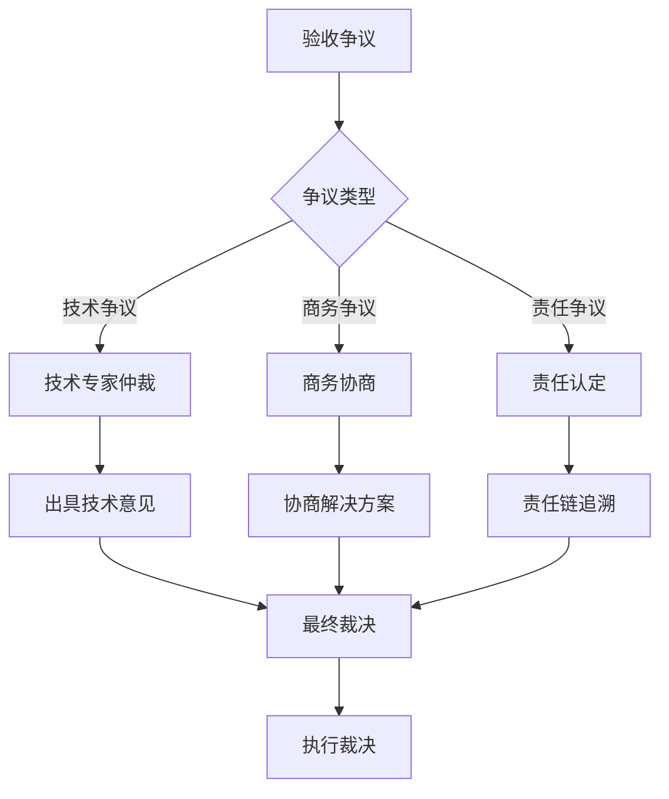

# 产品设计方案 - 问题分析与优化建议

## 一、业务逻辑层面的问题与建议

### 1.1 项目层级分解的灵活性问题

#### 问题描述
当前方案支持最多4层项目分解，但实际业务场景中：
- **不同项目类型需求不同**：家装项目可能只需要2-3层，而大型工装项目可能需要更多层级
- **层级命名固化**：主项目、子项目、孙项目、任务包的命名过于固定，不够灵活
- **层级间关系单一**：仅支持父子关系，不支持跨层级引用或共享

#### 解决方案

**方案一：动态层级配置**
```sql
-- 增加项目类型配置表
CREATE TABLE project_type_config (
    id BIGINT PRIMARY KEY,
    type_name VARCHAR(50) COMMENT '项目类型名称',
    max_level INT DEFAULT 4 COMMENT '最大层级数',
    level_names JSON COMMENT '各层级名称配置',
    
    -- 示例：家装项目配置
    -- level_names: {"1": "装修项目", "2": "施工阶段", "3": "施工项目", "4": "施工任务"}
    
    create_time DATETIME DEFAULT CURRENT_TIMESTAMP
) COMMENT='项目类型配置表';
```

**方案二：层级别名机制**
```sql
-- 项目层级增加别名
ALTER TABLE project_hierarchy ADD COLUMN level_alias VARCHAR(50) COMMENT '层级别名';

-- 示例：
-- 层级1：装修项目（主项目）
-- 层级2：水电工程（子项目）→ 可命名为"施工阶段"
-- 层级3：强电工程（孙项目）→ 可命名为"施工项目"
-- 层级4：开槽布线（任务包）→ 可命名为"施工任务"
```

**方案三：跨层级引用机制**
```sql
-- 增加跨层级引用表
CREATE TABLE project_reference (
    id BIGINT PRIMARY KEY,
    source_project_id BIGINT COMMENT '源项目ID',
    target_project_id BIGINT COMMENT '目标项目ID',
    reference_type TINYINT COMMENT '引用类型：1-共享 2-依赖 3-关联',
    
    create_time DATETIME DEFAULT CURRENT_TIMESTAMP,
    
    INDEX idx_source (source_project_id),
    INDEX idx_target (target_project_id)
) COMMENT='项目跨层级引用表';
```

---

### 1.2 合同金额汇总的准确性问题

#### 问题描述
当前方案中合同金额向上汇总，但存在以下问题：
- **重复计算风险**：主合同可能已包含部分子合同内容，导致重复计算
- **金额变更同步**：子合同金额变更后，主合同金额如何同步更新
- **部分合同缺失**：某些子项目可能没有独立合同，如何处理金额汇总

#### 解决方案

**方案一：合同金额类型区分**
```sql
-- 合同增加金额类型字段
ALTER TABLE contract_hierarchy ADD COLUMN amount_type TINYINT COMMENT '金额类型：1-独立金额 2-包含子合同 3-被包含';

-- 金额计算规则：
-- 类型1（独立金额）：独立计算，不参与汇总
-- 类型2（包含子合同）：金额 = 自身金额 + 子合同金额
-- 类型3（被包含）：金额已包含在父合同中，不重复计算
```

**方案二：合同金额变更日志**
```sql
-- 合同金额变更记录表
CREATE TABLE contract_amount_log (
    id BIGINT PRIMARY KEY,
    contract_id BIGINT NOT NULL COMMENT '合同ID',
    
    old_amount DECIMAL(12,2) COMMENT '变更前金额',
    new_amount DECIMAL(12,2) COMMENT '变更后金额',
    change_reason VARCHAR(500) COMMENT '变更原因',
    
    -- 级联更新标记
    cascade_update TINYINT DEFAULT 0 COMMENT '是否级联更新父合同',
    
    create_by BIGINT COMMENT '操作人',
    create_time DATETIME DEFAULT CURRENT_TIMESTAMP,
    
    INDEX idx_contract_id (contract_id)
) COMMENT='合同金额变更日志表';
```

**方案三：项目预算与合同金额分离**
```sql
-- 项目预算独立管理
ALTER TABLE project_hierarchy ADD COLUMN contract_total_amount DECIMAL(12,2) COMMENT '合同总金额';
ALTER TABLE project_hierarchy ADD COLUMN budget_amount DECIMAL(12,2) COMMENT '预算金额';

-- 计算规则：
-- contract_total_amount = SUM(所有关联合同金额)
-- budget_amount = 项目立项时的预算金额
-- 两者独立管理，互不影响
```

---

### 1.3 跨合同验收的权责边界问题

#### 问题描述
跨合同验收虽然灵活，但存在权责边界模糊的问题：
- **验收责任归属**：跨合同验收人验收后，出现质量问题谁负责
- **验收争议处理**：跨合同验收人与合同内验收人意见不一致如何处理
- **验收时效性**：跨合同验收可能因人员不熟悉业务导致验收效率低

#### 解决方案

**方案一：验收责任链机制**
```sql
-- 验收责任链配置
CREATE TABLE accept_responsibility_chain (
    id BIGINT PRIMARY KEY,
    task_id BIGINT NOT NULL COMMENT '任务ID',
    
    -- 验收人信息
    acceptor_id BIGINT NOT NULL COMMENT '验收人ID',
    acceptor_type TINYINT COMMENT '验收人类型：1-合同内 2-跨合同',
    
    -- 责任权重
    responsibility_weight INT DEFAULT 100 COMMENT '责任权重：合同内100%，跨合同按比例',
    
    -- 验收顺序
    accept_order INT COMMENT '验收顺序',
    
    -- 责任范围
    responsibility_scope VARCHAR(500) COMMENT '责任范围描述',
    
    create_time DATETIME DEFAULT CURRENT_TIMESTAMP,
    
    INDEX idx_task_id (task_id)
) COMMENT='验收责任链表';
```

**方案二：验收争议处理流程**


**方案三：跨合同验收人资质认证**
```sql
-- 验收人资质认证表
CREATE TABLE acceptor_qualification (
    id BIGINT PRIMARY KEY,
    user_id BIGINT NOT NULL COMMENT '用户ID',
    
    -- 资质信息
    qualification_type VARCHAR(50) COMMENT '资质类型：水电验收/泥瓦验收/木工验收等',
    qualification_level TINYINT COMMENT '资质等级：1-初级 2-中级 3-高级',
    
    -- 认证信息
    cert_no VARCHAR(100) COMMENT '证书编号',
    cert_file VARCHAR(500) COMMENT '证书文件',
    valid_start_date DATE COMMENT '有效期开始',
    valid_end_date DATE COMMENT '有效期结束',
    
    -- 跨合同验收权限
    can_cross_contract TINYINT DEFAULT 0 COMMENT '是否可跨合同验收',
    
    create_time DATETIME DEFAULT CURRENT_TIMESTAMP,
    
    INDEX idx_user_id (user_id)
) COMMENT='验收人资质认证表';
```

---

## 二、数据模型层面的问题与建议

### 2.1 数据一致性保障问题

#### 问题描述
多层级数据汇总存在一致性风险：
- **进度数据一致性**：任务进度变更后，合同进度、项目进度的同步更新
- **成本数据一致性**：任务成本变更后，合同成本、项目成本的同步更新
- **并发更新冲突**：多人同时更新不同层级数据可能导致数据不一致

#### 解决方案

**方案一：数据版本控制**
```sql
-- 数据版本控制表
CREATE TABLE data_version_control (
    id BIGINT PRIMARY KEY,
    entity_type VARCHAR(50) COMMENT '实体类型：project/contract/task',
    entity_id BIGINT COMMENT '实体ID',
    
    version_no INT COMMENT '版本号',
    data_snapshot JSON COMMENT '数据快照',
    
    -- 变更信息
    change_type TINYINT COMMENT '变更类型：1-创建 2-更新 3-删除',
    change_fields VARCHAR(500) COMMENT '变更字段列表',
    
    create_by BIGINT COMMENT '操作人',
    create_time DATETIME DEFAULT CURRENT_TIMESTAMP,
    
    INDEX idx_entity (entity_type, entity_id),
    INDEX idx_version (entity_type, entity_id, version_no)
) COMMENT='数据版本控制表';
```

**方案二：数据一致性校验机制**
```sql
-- 数据一致性校验规则表
CREATE TABLE consistency_check_rule (
    id BIGINT PRIMARY KEY,
    rule_name VARCHAR(100) COMMENT '规则名称',
    rule_type TINYINT COMMENT '规则类型：1-进度一致性 2-成本一致性 3-状态一致性',
    
    -- 校验规则
    source_entity VARCHAR(50) COMMENT '源实体类型',
    target_entity VARCHAR(50) COMMENT '目标实体类型',
    check_expression VARCHAR(500) COMMENT '校验表达式',
    
    -- 处理方式
    handle_type TINYINT COMMENT '处理方式：1-自动修复 2-告警 3-阻断',
    
    status TINYINT DEFAULT 1 COMMENT '状态：1-启用 2-禁用',
    create_time DATETIME DEFAULT CURRENT_TIMESTAMP
) COMMENT='数据一致性校验规则表';
```

**方案三：分布式锁机制**
```java
// 伪代码示例
public void updateProjectProgress(Long projectId, Integer progress) {
    // 获取分布式锁
    String lockKey = "project_progress_update:" + projectId;
    try {
        // 尝试获取锁，超时时间10秒
        boolean locked = redisLock.tryLock(lockKey, 10, TimeUnit.SECONDS);
        if (locked) {
            // 更新项目进度
            projectMapper.updateProgress(projectId, progress);
            
            // 级联更新父项目进度
            cascadeUpdateParentProgress(projectId);
            
            // 记录变更日志
            logProgressChange(projectId, progress);
        } else {
            throw new BusinessException("系统繁忙，请稍后重试");
        }
    } finally {
        // 释放锁
        redisLock.unlock(lockKey);
    }
}
```

---

### 2.2 数据查询性能问题

#### 问题描述
多层级数据查询可能存在性能问题：
- **递归查询性能**：查询项目树、合同树时的递归查询效率
- **汇总数据计算**：实时计算项目进度、成本等汇总数据
- **大数据量处理**：项目数量、任务数量增长后的查询性能

#### 解决方案

**方案一：预计算汇总表**
```sql
-- 项目汇总数据预计算表
CREATE TABLE project_summary (
    id BIGINT PRIMARY KEY,
    project_id BIGINT NOT NULL COMMENT '项目ID',
    
    -- 进度汇总
    progress INT COMMENT '整体进度',
    sub_project_progress JSON COMMENT '子项目进度',
    
    -- 成本汇总
    total_budget DECIMAL(12,2) COMMENT '总预算',
    total_cost DECIMAL(12,2) COMMENT '总成本',
    contract_amount DECIMAL(12,2) COMMENT '合同总金额',
    
    -- 质量汇总
    total_task_count INT COMMENT '任务总数',
    completed_task_count INT COMMENT '已完成任务数',
    accept_pass_rate DECIMAL(5,2) COMMENT '验收通过率',
    
    -- 时间戳
    calculate_time DATETIME COMMENT '计算时间',
    create_time DATETIME DEFAULT CURRENT_TIMESTAMP,
    update_time DATETIME DEFAULT CURRENT_TIMESTAMP ON UPDATE CURRENT_TIMESTAMP,
    
    UNIQUE KEY uk_project_id (project_id),
    INDEX idx_calculate_time (calculate_time)
) COMMENT='项目汇总数据表';
```

**方案二：物化视图**
```sql
-- 创建物化视图：项目层级视图
CREATE MATERIALIZED VIEW mv_project_hierarchy AS
SELECT 
    p1.id AS level1_id,
    p1.project_name AS level1_name,
    p2.id AS level2_id,
    p2.project_name AS level2_name,
    p3.id AS level3_id,
    p3.project_name AS level3_name,
    p4.id AS level4_id,
    p4.project_name AS level4_name
FROM project_hierarchy p1
LEFT JOIN project_hierarchy p2 ON p2.parent_id = p1.id AND p2.level = 2
LEFT JOIN project_hierarchy p3 ON p3.parent_id = p2.id AND p3.level = 3
LEFT JOIN project_hierarchy p4 ON p4.parent_id = p3.id AND p4.level = 4
WHERE p1.level = 1;

-- 定时刷新物化视图
-- 每小时刷新一次
CREATE EVENT refresh_mv_project_hierarchy
ON SCHEDULE EVERY 1 HOUR
DO
    REFRESH MATERIALIZED VIEW mv_project_hierarchy;
```

**方案三：读写分离 + 缓存**
```
架构设计：
┌─────────────┐
│   写操作    │ → 主库 → 触发器/消息队列 → 更新汇总表
└─────────────┘
┌─────────────┐
│   读操作    │ → 从库/缓存 ← 汇总表
└─────────────┘

缓存策略：
- 热点数据：Redis缓存，TTL 5分钟
- 汇总数据：Redis缓存，TTL 1小时
- 明细数据：MySQL从库查询
```

---

### 2.3 数据权限粒度问题

#### 问题描述
当前权限模型可能存在粒度不够细的问题：
- **字段级权限缺失**：无法控制用户对特定字段的访问权限
- **数据行权限缺失**：无法控制用户对特定数据行的访问权限
- **动态权限缺失**：无法根据数据状态动态调整权限

#### 解决方案

**方案一：字段级权限控制**
```sql
-- 字段级权限配置表
CREATE TABLE field_permission (
    id BIGINT PRIMARY KEY,
    role_id BIGINT COMMENT '角色ID',
    user_id BIGINT COMMENT '用户ID',
    
    -- 资源信息
    resource_type VARCHAR(50) COMMENT '资源类型：project/contract/task',
    field_name VARCHAR(50) COMMENT '字段名称',
    
    -- 权限类型
    permission_type TINYINT COMMENT '权限类型：1-可见 2-可编辑 3-不可见',
    
    -- 条件表达式
    condition_expression VARCHAR(500) COMMENT '条件表达式',
    
    create_time DATETIME DEFAULT CURRENT_TIMESTAMP,
    
    INDEX idx_role (role_id),
    INDEX idx_user (user_id)
) COMMENT='字段级权限表';
```

**方案二：数据行权限控制**
```sql
-- 数据行权限配置表
CREATE TABLE row_permission (
    id BIGINT PRIMARY KEY,
    role_id BIGINT COMMENT '角色ID',
    user_id BIGINT COMMENT '用户ID',
    
    -- 资源信息
    resource_type VARCHAR(50) COMMENT '资源类型',
    
    -- 行过滤条件
    row_filter VARCHAR(500) COMMENT '行过滤条件SQL',
    
    -- 示例：
    -- 项目负责人：project_owner_id = ${current_user_id}
    -- 合同相关方：contract_party_a_id = ${current_user_id} OR contract_party_b_id = ${current_user_id}
    
    create_time DATETIME DEFAULT CURRENT_TIMESTAMP,
    
    INDEX idx_role (role_id),
    INDEX idx_user (user_id)
) COMMENT='数据行权限表';
```

**方案三：动态权限规则**
```sql
-- 动态权限规则表
CREATE TABLE dynamic_permission_rule (
    id BIGINT PRIMARY KEY,
    rule_name VARCHAR(100) COMMENT '规则名称',
    
    -- 触发条件
    trigger_condition VARCHAR(500) COMMENT '触发条件',
    -- 示例：project_status = 3 AND task_progress = 100
    
    -- 权限变更
    permission_change JSON COMMENT '权限变更配置',
    -- 示例：{"add": ["view_cost"], "remove": ["edit_task"]}
    
    -- 生效范围
    scope_type TINYINT COMMENT '范围类型：1-项目级 2-合同级 3-任务级',
    
    status TINYINT DEFAULT 1 COMMENT '状态：1-启用 2-禁用',
    create_time DATETIME DEFAULT CURRENT_TIMESTAMP
) COMMENT='动态权限规则表';
```

---

## 三、用户体验层面的问题与建议

### 3.1 层级关系的可视化呈现问题

#### 问题描述
4层层级关系复杂，用户难以直观理解：
- **层级深度感知弱**：用户不清楚当前在第几层
- **层级跳转困难**：跨层级跳转操作繁琐
- **层级关系展示不清晰**：父子关系、合同关系、任务关系交织

#### 解决方案

**方案一：面包屑导航 + 层级指示器**
```
设计示例：

┌─────────────────────────────────────────────────────────┐
│ 🏠 主项目：XX小区整体装修 > 子项目：水电工程 > 孙项目：强电工程 │
│                                                          │
│ 层级指示器：                                              │
│ [●]主项目 ─ [●]子项目 ─ [●]孙项目 ─ [○]任务包           │
│  Level1    Level2    Level3    Level4                  │
└─────────────────────────────────────────────────────────┘

交互设计：
- 点击面包屑可快速跳转
- 层级指示器显示当前位置
- 不同层级使用不同颜色区分
```

**方案二：树状图 + 详情面板**
```
设计示例：

┌──────────────────────┬──────────────────────────────┐
│      项目树状图       │          详情面板             │
│                      │                              │
│ 📁 XX小区整体装修     │  当前选中：强电工程           │
│   ├─📁 水电工程 ←    │  ──────────────────          │
│   │  ├─📄 强电工程   │  层级：孙项目（Level 3）      │
│   │  ├─📄 弱电工程   │  进度：65%                    │
│   │  └─📄 给排水工程 │  合同：水电分包合同           │
│   ├─📁 泥瓦工程      │  任务数：12个                 │
│   ├─📁 木工工程      │  负责人：张工                 │
│   └─📁 油漆工程      │                              │
│                      │  [查看详情] [编辑] [分解]     │
└──────────────────────┴──────────────────────────────┘

交互设计：
- 左侧树状图可展开/折叠
- 右侧详情面板联动显示
- 双击可进入下一层级
```

**方案三：层级切换器**
```
设计示例：

┌─────────────────────────────────────────────────────────┐
│  层级切换：[主项目] [子项目] [孙项目] [任务包]           │
│                                                          │
│  当前层级：子项目（共4个子项目）                          │
│  ────────────────────────────────────────────────       │
│  │ 序号 │ 子项目名称   │ 进度  │ 合同状态  │ 操作    │  │
│  │  1   │ 水电工程     │ 65%   │ 执行中    │ [详情]  │  │
│  │  2   │ 泥瓦工程     │ 30%   │ 执行中    │ [详情]  │  │
│  │  3   │ 木工工程     │ 0%    │ 待启动    │ [详情]  │  │
│  │  4   │ 油漆工程     │ 0%    │ 待启动    │ [详情]  │  │
└─────────────────────────────────────────────────────────┘

交互设计：
- 点击层级标签快速切换
- 显示当前层级所有项目
- 支持筛选、排序、搜索
```

---

### 3.2 跨合同验收的操作复杂性问题

#### 问题描述
跨合同验收涉及多方协作，操作复杂：
- **验收人选择困难**：需要从多个合同中选择验收人
- **验收流程不清晰**：用户不清楚验收流程和当前状态
- **验收通知混乱**：跨合同验收通知可能遗漏或重复

#### 解决方案

**方案一：智能验收人推荐**
```
设计示例：

┌─────────────────────────────────────────────────────────┐
│  申请验收 - 任务：开槽布线                               │
│  ────────────────────────────────────────────────       │
│  任务所属合同：水电分包合同                              │
│                                                          │
│  推荐验收人：                                            │
│  ┌─────────────────────────────────────────────┐       │
│  │ ⭐ 李监理（主合同监理）                       │       │
│  │    推荐理由：主合同指定监理，有跨合同验收权限 │       │
│  │    资质：高级监理工程师                       │       │
│  └─────────────────────────────────────────────┘       │
│                                                          │
│  其他验收人：                                            │
│  ┌─────────────────────────────────────────────┐       │
│  │ ○ 王工长（本合同负责人）                     │       │
│  │ ○ 张总（项目总负责人）                       │       │
│  └─────────────────────────────────────────────┘       │
│                                                          │
│  [确认提交]                                              │
└─────────────────────────────────────────────────────────┘

智能推荐逻辑：
1. 优先推荐主合同指定的监理
2. 其次推荐本合同负责人
3. 最后推荐项目总负责人
4. 显示推荐理由和资质信息
```

**方案二：验收流程可视化**
```
设计示例：

┌─────────────────────────────────────────────────────────┐
│  验收流程                                                │
│  ────────────────────────────────────────────────       │
│                                                          │
│  ① 施工方申请 ──→ ② 监理验收 ──→ ③ 业主确认 ──→ ④ 完成  │
│     ✓ 已完成          ⏳ 进行中        ○ 待处理      ○   │
│                                                          │
│  当前状态：监理验收中                                     │
│  验收人：李监理                                          │
│  预计完成时间：2024-01-15 18:00                          │
│                                                          │
│  [催办] [查看详情] [联系验收人]                          │
└─────────────────────────────────────────────────────────┘

流程可视化设计：
- 清晰展示验收步骤
- 标记当前状态
- 显示预计完成时间
- 提供快捷操作入口
```

**方案三：验收通知聚合**
```
设计示例：

┌─────────────────────────────────────────────────────────┐
│  消息中心（3条待处理）                                    │
│  ────────────────────────────────────────────────       │
│                                                          │
│  🔴 待验收任务（2条）                                    │
│  ┌─────────────────────────────────────────────┐       │
│  │ 水电工程 - 开槽布线                          │       │
│  │ 申请时间：2024-01-15 10:30                   │       │
│  │ 来源：跨合同验收（水电分包合同）             │       │
│  │ [立即验收] [稍后处理]                        │       │
│  └─────────────────────────────────────────────┘       │
│                                                          │
│  🟡 验收完成通知（1条）                                  │
│  ┌─────────────────────────────────────────────┐       │
│  │ 泥瓦工程 - 墙面贴砖                          │       │
│  │ 验收结果：通过                               │       │
│  │ 验收人：李监理                               │       │
│  │ [查看详情]                                   │       │
│  └─────────────────────────────────────────────┘       │
└─────────────────────────────────────────────────────────┘

通知聚合规则：
- 按类型分组：待验收、已完成、异常
- 按优先级排序：紧急 > 重要 > 普通
- 按时间排序：最新优先
- 支持批量操作
```

---

### 3.3 数据看板的信息过载问题

#### 问题描述
多层级数据看板信息量大，用户容易信息过载：
- **指标过多**：进度、成本、质量、时间等多维度指标
- **层级嵌套**：项目→子项目→合同→任务的多层级数据
- **实时更新**：数据实时变化，用户难以捕捉关键信息

#### 解决方案

**方案一：关键指标突出显示**
```
设计示例：

┌─────────────────────────────────────────────────────────┐
│  项目看板 - XX小区整体装修                               │
│  ────────────────────────────────────────────────       │
│                                                          │
│  ┌──────────┐  ┌──────────┐  ┌──────────┐  ┌──────────┐│
│  │  进度    │  │  成本    │  │  质量    │  │  时间    ││
│  │  65%     │  │  78%     │  │  92%     │  │  正常    ││
│  │  ⚠️预警  │  │  ⚠️预警  │  │  ✓正常   │  │  ✓正常   ││
│  └──────────┘  └──────────┘  └──────────┘  └──────────┘│
│                                                          │
│  预警信息：                                              │
│  🔴 水电工程进度滞后，预计延期3天                        │
│  🟡 成本超预算8%，建议优化材料采购                       │
│                                                          │
│  [查看详细数据] [导出报告]                               │
└─────────────────────────────────────────────────────────┘

设计原则：
- 核心指标大字显示
- 异常状态醒目标识
- 预警信息优先展示
- 支持快速查看详情
```

**方案二：层级数据折叠展示**
```
设计示例：

┌─────────────────────────────────────────────────────────┐
│  子项目进度总览                                          │
│  ────────────────────────────────────────────────       │
│                                                          │
│  ▼ 水电工程（65%）                          [展开] [详情]│
│  ├─ 强电工程（80%）                                      │
│  ├─ 弱电工程（60%）                                      │
│  └─ 给排水工程（55%）                                    │
│                                                          │
│  ▶ 泥瓦工程（30%）                          [展开] [详情]│
│  ▶ 木工工程（0%）                           [展开] [详情]│
│  ▶ 油漆工程（0%）                           [展开] [详情]│
│                                                          │
└─────────────────────────────────────────────────────────┘

交互设计：
- 默认只显示第一层级
- 点击展开查看子层级
- 支持全部展开/折叠
- 点击详情跳转到详情页
```

**方案三：个性化看板配置**
```
设计示例：

┌─────────────────────────────────────────────────────────┐
│  看板配置                                                │
│  ────────────────────────────────────────────────       │
│                                                          │
│  选择关注的指标：                                        │
│  ☑ 进度指标                                              │
│  ☑ 成本指标                                              │
│  ☐ 质量指标                                              │
│  ☐ 时间指标                                              │
│                                                          │
│  选择关注的层级：                                        │
│  ☑ 主项目                                                │
│  ☑ 子项目                                                │
│  ☐ 孙项目                                                │
│  ☐ 任务包                                                │
│                                                          │
│  预警阈值设置：                                          │
│  进度预警：[  80  ]% 以下                                │
│  成本预警：[  90  ]% 以上                                │
│                                                          │
│  [保存配置] [恢复默认]                                   │
└─────────────────────────────────────────────────────────┘

个性化配置：
- 用户自定义关注的指标
- 用户自定义关注的层级
- 用户自定义预警阈值
- 配置保存到用户偏好
```

---

## 四、技术实现层面的问题与建议

### 4.1 数据同步与一致性问题

#### 问题描述
多层级数据同步存在技术挑战：
- **实时性要求**：数据变更需要实时同步到所有相关层级
- **一致性保障**：多表关联更新需要保证事务一致性
- **性能影响**：频繁的数据同步可能影响系统性能

#### 解决方案

**方案一：事件驱动架构**
```
架构设计：

┌─────────────┐
│  任务服务   │
└──────┬──────┘
       │ 发布事件
       ▼
┌─────────────────────────────────────┐
│         消息队列（MQ）               │
│  Topic: task_progress_changed       │
└──────────┬──────────────────────────┘
           │ 订阅事件
           ▼
┌─────────────────────────────────────┐
│         事件处理器                   │
│  1. 更新合同进度                     │
│  2. 更新项目进度                     │
│  3. 更新看板数据                     │
│  4. 发送通知消息                     │
└─────────────────────────────────────┘

技术选型：
- 消息队列：RocketMQ / RabbitMQ
- 事件格式：CloudEvents标准
- 幂等处理：基于事件ID去重
```

**方案二：分布式事务**
```
技术方案：Seata AT模式

// 伪代码示例
@GlobalTransactional
public void updateTaskProgress(Long taskId, Integer progress) {
    // 1. 更新任务进度
    taskService.updateProgress(taskId, progress);
    
    // 2. 更新合同进度
    contractService.updateProgressByTask(taskId);
    
    // 3. 更新项目进度
    projectService.updateProgressByTask(taskId);
    
    // 4. 更新看板数据
    dashboardService.refreshByTask(taskId);
    
    // Seata自动处理分布式事务
    // 任一步骤失败，自动回滚所有操作
}
```

**方案三：数据同步中间件**
```
技术方案：Canal + Kafka

架构设计：

MySQL主库
    │
    ▼
┌─────────────┐
│   Canal     │  监听MySQL binlog
└──────┬──────┘
       │ 解析binlog
       ▼
┌─────────────┐
│   Kafka     │  消息队列
└──────┬──────┘
       │ 消费消息
       ▼
┌─────────────┐
│  数据同步   │
│  服务      │
└──────┬──────┘
       │ 同步数据
       ▼
┌─────────────┐
│  从库/缓存  │
└─────────────┘

优势：
- 解耦数据同步逻辑
- 支持异构数据同步
- 支持数据订阅
```

---

### 4.2 权限计算性能问题

#### 问题描述
精细化权限计算可能影响性能：
- **权限计算复杂**：多层级、多维度权限计算
- **权限判断频繁**：每次数据访问都需要权限判断
- **权限缓存失效**：权限变更后缓存失效策略

#### 解决方案

**方案一：权限预计算**
```sql
-- 权限预计算结果表
CREATE TABLE permission_cache (
    id BIGINT PRIMARY KEY,
    user_id BIGINT NOT NULL COMMENT '用户ID',
    resource_type VARCHAR(50) COMMENT '资源类型',
    resource_id BIGINT COMMENT '资源ID',
    
    -- 预计算权限
    permissions JSON COMMENT '权限列表',
    -- 示例：{"view": true, "edit": true, "delete": false}
    
    -- 缓存信息
    cache_time DATETIME COMMENT '缓存时间',
    expire_time DATETIME COMMENT '过期时间',
    
    INDEX idx_user_resource (user_id, resource_type, resource_id),
    INDEX idx_expire_time (expire_time)
) COMMENT='权限缓存表';
```

**方案二：权限位图**
```
权限位图设计：

权限编码：
- 查看权限：bit 0 (值：1)
- 编辑权限：bit 1 (值：2)
- 删除权限：bit 2 (值：4)
- 审批权限：bit 3 (值：8)
- 执行权限：bit 4 (值：16)
- 验收权限：bit 5 (值：32)

权限值计算：
- 查看+编辑 = 1 + 2 = 3
- 查看+编辑+删除 = 1 + 2 + 4 = 7
- 全部权限 = 1 + 2 + 4 + 8 + 16 + 32 = 63

权限判断：
// 判断是否有编辑权限
boolean hasEditPermission(int permissionValue) {
    return (permissionValue & 2) == 2;
}

优势：
- 权限存储空间小
- 权限判断速度快
- 支持位运算
```

**方案三：权限缓存策略**
```
缓存策略设计：

1. 多级缓存
   - L1缓存：本地缓存（Caffeine），TTL 5分钟
   - L2缓存：分布式缓存（Redis），TTL 30分钟
   - L3缓存：数据库

2. 缓存失效策略
   - 权限变更时：主动清除相关缓存
   - 用户角色变更时：清除用户所有权限缓存
   - 项目成员变更时：清除项目相关权限缓存

3. 缓存预热
   - 用户登录时：预加载常用权限
   - 项目访问时：预加载项目权限

4. 缓存监控
   - 缓存命中率监控
   - 缓存失效频率监控
   - 权限计算耗时监控
```

---

### 4.3 系统扩展性问题

#### 问题描述
系统未来可能面临扩展需求：
- **业务扩展**：新业务场景、新功能模块
- **数据扩展**：数据量增长、查询性能下降
- **用户扩展**：用户量增长、并发量增长

#### 解决方案

**方案一：微服务架构**
```
服务拆分：

┌─────────────────────────────────────────────────────────┐
│                      API网关                            │
└───────────────────────────┬─────────────────────────────┘
                            │
        ┌───────────────────┼───────────────────┐
        │                   │                   │
        ▼                   ▼                   ▼
┌──────────────┐  ┌──────────────┐  ┌──────────────┐
│  项目服务    │  │  合同服务    │  │  任务服务    │
└──────────────┘  └──────────────┘  └──────────────┘
        │                   │                   │
        ▼                   ▼                   ▼
┌──────────────┐  ┌──────────────┐  ┌──────────────┐
│  权限服务    │  │  消息服务    │  │  看板服务    │
└──────────────┘  └──────────────┘  └──────────────┘

服务治理：
- 服务注册与发现：Nacos
- 配置中心：Nacos
- 服务网关：Spring Cloud Gateway
- 负载均衡：Ribbon
- 熔断降级：Sentinel
```

**方案二：分库分表**
```
分库分表策略：

1. 垂直分库
   - 用户库：用户、角色、权限
   - 项目库：项目、子项目、任务
   - 合同库：合同、签署记录
   - 消息库：消息、通知

2. 水平分表
   - 项目表：按年度分表（project_2024, project_2025）
   - 任务表：按项目ID分表
   - 消息表：按用户ID分表

3. 分片键选择
   - 项目表：project_id
   - 任务表：project_id
   - 消息表：user_id

技术选型：
- 分库分表中间件：ShardingSphere
- 分布式ID生成：Snowflake
```

**方案三：读写分离**
```
读写分离架构：

┌─────────────┐
│   应用层    │
└──────┬──────┘
       │
       ▼
┌─────────────────────────────────────┐
│         读写分离路由                 │
│  写操作 → 主库                       │
│  读操作 → 从库                       │
└──────┬──────────────────┬───────────┘
       │                  │
       ▼                  ▼
┌─────────────┐    ┌─────────────┐
│   主库      │───→│   从库1     │
│  (写+读)    │    │  (只读)     │
└─────────────┘    └─────────────┘
       │                  │
       │                  ▼
       │           ┌─────────────┐
       │           │   从库2     │
       │           │  (只读)     │
       │           └─────────────┘
       │
       ▼
┌─────────────┐
│   从库3     │
│  (只读)     │
└─────────────┘

技术实现：
- 中间件：ShardingSphere / MyCat
- 主从同步：MySQL主从复制
- 负载均衡：轮询/权重
```

---

## 五、商业化层面的问题与建议

### 5.1 免费到付费的转化问题

#### 问题描述
从免费模式转向付费模式可能面临：
- **用户付费意愿低**：用户习惯免费使用
- **付费价值不清晰**：用户不清楚付费版的价值
- **转化路径不明确**：如何引导用户付费

#### 解决方案

**方案一：功能分级策略**
```
版本功能对比：

┌─────────────────────────────────────────────────────────┐
│  功能              │ 基础版（免费）  │ 专业版（99元/月） │ 企业版（299元/月）│
├─────────────────────────────────────────────────────────┤
│  项目数量          │ 3个            │ 不限             │ 不限             │
│  项目层级          │ 2层            │ 4层              │ 4层              │
│  合同管理          │ 3个            │ 不限             │ 不限             │
│  任务管理          │ 基础功能       │ 完整功能         │ 完整功能         │
│  数据看板          │ 基础看板       │ 高级看板         │ 自定义看板       │
│  权限管理          │ 基础权限       │ 精细化权限       │ 自定义权限       │
│  资料库            │ 1GB            │ 10GB            │ 不限             │
│  数据导出          │ ✗              │ ✓               │ ✓               │
│  API接口           │ ✗              │ ✗               │ ✓               │
│  私有化部署        │ ✗              │ ✗               │ ✓               │
│  技术支持          │ 社区支持       │ 工单支持         │ 专属客服         │
└─────────────────────────────────────────────────────────┘

转化策略：
- 基础版：满足个人用户、小型项目需求
- 专业版：满足中小型企业需求，提供完整功能
- 企业版：满足大型企业需求，提供定制化服务
```

**方案二：增值服务策略**
```
增值服务设计：

1. 数据服务
   - 行业数据分析报告：999元/份
   - 项目成本对标分析：299元/次
   - 供应商评估报告：199元/份

2. 专家服务
   - 在线咨询服务：99元/小时
   - 项目诊断服务：499元/次
   - 定制化培训：1999元/场

3. 增值功能
   - 数据备份服务：29元/月
   - 高级报表功能：49元/月
   - 多端同步功能：19元/月

转化路径：
免费用户 → 使用增值服务 → 认识到价值 → 转化为付费用户
```

**方案三：试用期策略**
```
试用期设计：

1. 新用户试用
   - 注册即送14天专业版试用
   - 试用期内可使用所有专业版功能
   - 试用期结束前3天提醒

2. 功能试用
   - 付费功能可试用3次
   - 试用后引导付费
   - 提供试用报告

3. 推荐试用
   - 邀请好友注册，双方各得7天专业版
   - 邀请3人以上，额外赠送数据报告

转化策略：
试用 → 体验价值 → 引导付费 → 提供优惠 → 完成转化
```

---

### 5.2 用户粘性问题

#### 问题描述
如何提升用户粘性，降低用户流失：
- **用户活跃度低**：用户使用频率不高
- **用户流失率高**：用户容易流失
- **用户忠诚度低**：用户容易转向竞品

#### 解决方案

**方案一：用户成长体系**
```
成长体系设计：

等级设计：
- LV1 新手：注册用户
- LV2 熟手：完成1个项目
- LV3 专家：完成5个项目
- LV4 大师：完成10个项目
- LV5 专家：完成20个项目

权益设计：
- LV1：基础功能
- LV2：解锁高级看板
- LV3：解锁数据分析
- LV4：解锁API接口
- LV5：解锁专属客服

成长任务：
- 每日签到：+10经验
- 完成任务：+50经验
- 邀请好友：+100经验
- 发布评价：+30经验
```

**方案二：社区运营**
```
社区运营设计：

1. 内容运营
   - 项目案例分享
   - 行业资讯推送
   - 专家经验分享

2. 活动运营
   - 月度优秀项目评选
   - 季度用户交流会
   - 年度用户大会

3. 用户运营
   - 核心用户社群
   - 专家用户认证
   - 用户意见反馈

目标：
- 提升用户活跃度
- 增强用户归属感
- 形成用户口碑
```

**方案三：数据驱动运营**
```
数据驱动设计：

1. 用户行为分析
   - 用户访问路径
   - 功能使用频率
   - 用户停留时长

2. 用户分群运营
   - 高价值用户：专属服务
   - 活跃用户：激励引导
   - 流失用户：召回策略

3. 个性化推荐
   - 推荐相关项目
   - 推荐相关功能
   - 推荐相关内容

工具：
- 用户行为分析：神策数据/友盟
- 用户分群：RFM模型
- 个性化推荐：协同过滤算法
```

---

### 5.3 竞争壁垒构建问题

#### 问题描述
如何构建可持续的竞争壁垒：
- **技术壁垒弱**：技术方案容易被复制
- **数据壁垒弱**：数据积累不足
- **品牌壁垒弱**：品牌认知度低

#### 解决方案

**方案一：数据壁垒构建**
```
数据壁垒策略：

1. 数据积累
   - 项目数据：项目数量、项目类型、项目规模
   - 用户数据：用户行为、用户偏好、用户关系
   - 行业数据：行业趋势、行业标杆、行业洞察

2. 数据价值挖掘
   - 行业基准数据：成本基准、工期基准、质量基准
   - 供应商评估数据：供应商评分、供应商排名
   - 用户信用数据：用户信用评分、用户能力评分

3. 数据服务输出
   - 行业分析报告
   - 项目评估服务
   - 供应商推荐服务

壁垒构建：
数据积累 → 数据价值挖掘 → 数据服务输出 → 数据壁垒
```

**方案二：网络效应构建**
```
网络效应策略：

1. 多边平台
   - 业主方：项目发起方
   - 服务商：项目执行方
   - 施工方：任务执行方
   - 材料商：材料供应方

2. 连接价值
   - 业主 ←→ 服务商：项目合作
   - 服务商 ←→ 施工方：任务分包
   - 施工方 ←→ 材料商：材料采购

3. 网络增长
   - 用户增长：用户越多，价值越大
   - 服务增长：服务越多，选择越多
   - 数据增长：数据越多，洞察越深

壁垒构建：
用户增长 → 网络效应 → 平台价值 → 网络壁垒
```

**方案三：品牌壁垒构建**
```
品牌壁垒策略：

1. 品牌定位
   - 定位：全透明家装共创共治共享平台
   - 口号：让家装更透明、更高效、更放心
   - 价值：透明、高效、放心

2. 品牌传播
   - 内容营销：行业文章、案例分享
   - 口碑营销：用户评价、案例展示
   - 活动营销：行业峰会、用户大会

3. 品牌维护
   - 服务质量保障
   - 用户投诉处理
   - 品牌危机公关

壁垒构建：
品牌定位 → 品牌传播 → 品牌认知 → 品牌壁垒
```

---

## 六、风险控制层面的问题与建议

### 6.1 数据安全风险

#### 问题描述
多层级数据涉及敏感信息：
- **合同金额泄露**：合同金额属于商业机密
- **项目信息泄露**：项目信息可能涉及商业机密
- **用户信息泄露**：用户信息属于隐私数据

#### 解决方案

**方案一：数据加密**
```
加密策略：

1. 传输加密
   - HTTPS加密传输
   - API签名验证
   - 敏感数据加密传输

2. 存储加密
   - 数据库字段加密：AES-256
   - 文件存储加密：OSS加密
   - 备份数据加密

3. 显示加密
   - 敏感字段脱敏：金额显示为***万
   - 手机号脱敏：138****1234
   - 身份证脱敏：310***********1234

技术实现：
- 加密算法：AES-256
- 密钥管理：KMS
- 脱敏规则：正则替换
```

**方案二：访问控制**
```
访问控制策略：

1. 身份认证
   - 多因素认证：密码+短信验证码
   - 单点登录：SSO
   - 设备绑定：限制登录设备

2. 权限控制
   - 最小权限原则
   - 权限定期审计
   - 异常权限告警

3. 访问日志
   - 记录所有访问行为
   - 异常访问告警
   - 访问日志留存

技术实现：
- 认证框架：Spring Security
- 权限框架：Apache Shiro
- 日志审计：ELK Stack
```

**方案三：数据备份**
```
备份策略：

1. 备份频率
   - 全量备份：每天凌晨2点
   - 增量备份：每小时
   - 日志备份：每15分钟

2. 备份存储
   - 本地备份：本地磁盘
   - 异地备份：异地机房
   - 云备份：阿里云OSS

3. 备份恢复
   - 定期恢复演练
   - 恢复时间目标：RTO < 4小时
   - 恢复点目标：RPO < 1小时

技术实现：
- 备份工具：XtraBackup
- 存储服务：阿里云OSS
- 恢复演练：每月一次
```

---

### 6.2 业务风险

#### 问题描述
业务运营可能面临风险：
- **合同纠纷**：合同条款理解不一致导致纠纷
- **验收争议**：验收标准不清晰导致争议
- **资金风险**：资金托管可能面临风险

#### 解决方案

**方案一：合同风险控制**
```
合同风险控制策略：

1. 合同模板标准化
   - 法务审核的合同模板
   - 明确的权利义务条款
   - 清晰的违约责任条款

2. 合同签署流程
   - 合同预览确认
   - 电子签名认证
   - 合同存证备案

3. 合同纠纷处理
   - 在线协商机制
   - 平台调解机制
   - 法律援助服务

技术实现：
- 电子签名：e签宝/法大大
- 合同存证：区块链存证
- 法律援助：合作律师事务所
```

**方案二：验收争议处理**
```
验收争议处理流程：

1. 争议预防
   - 明确验收标准
   - 验收过程记录
   - 验收照片存证

2. 争议处理
   - 在线协商：双方在线沟通
   - 专家仲裁：第三方专家介入
   - 平台裁决：平台根据规则裁决

3. 争议记录
   - 争议原因记录
   - 处理过程记录
   - 处理结果记录

技术实现：
- 验收标准库：标准化验收标准
- 专家库：第三方专家资源
- 仲裁机制：平台仲裁规则
```

**方案三：资金风险控制**
```
资金风险控制策略：

1. 资金托管
   - 第三方托管机构
   - 资金隔离管理
   - 资金流向透明

2. 支付控制
   - 多级审批机制
   - 支付限额控制
   - 异常支付告警

3. 资金保障
   - 资金保险
   - 风险准备金
   - 法律保障

技术实现：
- 托管机构：银行/第三方支付
- 支付渠道：微信支付/支付宝
- 保险服务：合作保险公司
```

---

## 七、总结与建议

### 7.1 核心问题汇总

| 问题类型 | 核心问题 | 影响程度 | 优先级 |
|----------|----------|----------|--------|
| 业务逻辑 | 层级分解灵活性不足 | 高 | P0 |
| 业务逻辑 | 合同金额汇总准确性 | 高 | P0 |
| 业务逻辑 | 跨合同验收权责边界 | 高 | P0 |
| 数据模型 | 数据一致性保障 | 高 | P0 |
| 数据模型 | 数据查询性能 | 中 | P1 |
| 数据模型 | 数据权限粒度 | 中 | P1 |
| 用户体验 | 层级关系可视化 | 高 | P0 |
| 用户体验 | 跨合同验收操作复杂 | 高 | P0 |
| 用户体验 | 数据看板信息过载 | 中 | P1 |
| 技术实现 | 数据同步与一致性 | 高 | P0 |
| 技术实现 | 权限计算性能 | 中 | P1 |
| 技术实现 | 系统扩展性 | 中 | P2 |
| 商业化 | 免费到付费转化 | 高 | P0 |
| 商业化 | 用户粘性 | 高 | P1 |
| 商业化 | 竞争壁垒构建 | 中 | P2 |
| 风险控制 | 数据安全风险 | 高 | P0 |
| 风险控制 | 业务风险 | 高 | P1 |

### 7.2 实施建议

#### 7.2.1 短期优化（1-3个月）

**优先级P0问题解决**：
1. 完善项目层级配置机制
2. 优化合同金额汇总逻辑
3. 建立验收责任链机制
4. 实现数据版本控制
5. 优化层级关系可视化
6. 简化跨合同验收流程
7. 实现事件驱动架构
8. 设计免费到付费转化路径
9. 建立数据安全机制

#### 7.2.2 中期优化（3-6个月）

**优先级P1问题解决**：
1. 优化数据查询性能
2. 完善数据权限粒度
3. 优化数据看板展示
4. 优化权限计算性能
5. 建立用户成长体系
6. 完善业务风险控制

#### 7.2.3 长期优化（6-12个月）

**优先级P2问题解决**：
1. 构建微服务架构
2. 实现分库分表
3. 构建竞争壁垒
4. 持续优化用户体验

---

## 附录：问题与解决方案对照表

| 问题编号 | 问题描述 | 解决方案 | 实施优先级 |
|----------|----------|----------|------------|
| Q1 | 层级分解灵活性不足 | 动态层级配置、层级别名机制 | P0 |
| Q2 | 合同金额汇总准确性 | 金额类型区分、变更日志、预算分离 | P0 |
| Q3 | 跨合同验收权责边界 | 验收责任链、争议处理、资质认证 | P0 |
| Q4 | 数据一致性保障 | 版本控制、一致性校验、分布式锁 | P0 |
| Q5 | 数据查询性能 | 预计算汇总表、物化视图、读写分离 | P1 |
| Q6 | 数据权限粒度 | 字段级权限、行权限、动态权限 | P1 |
| Q7 | 层级关系可视化 | 面包屑导航、树状图、层级切换器 | P0 |
| Q8 | 跨合同验收操作复杂 | 智能推荐、流程可视化、通知聚合 | P0 |
| Q9 | 数据看板信息过载 | 关键指标突出、层级折叠、个性化配置 | P1 |
| Q10 | 数据同步与一致性 | 事件驱动、分布式事务、数据同步中间件 | P0 |
| Q11 | 权限计算性能 | 权限预计算、权限位图、缓存策略 | P1 |
| Q12 | 系统扩展性 | 微服务架构、分库分表、读写分离 | P2 |
| Q13 | 免费到付费转化 | 功能分级、增值服务、试用期策略 | P0 |
| Q14 | 用户粘性 | 成长体系、社区运营、数据驱动运营 | P1 |
| Q15 | 竞争壁垒构建 | 数据壁垒、网络效应、品牌壁垒 | P2 |
| Q16 | 数据安全风险 | 数据加密、访问控制、数据备份 | P0 |
| Q17 | 业务风险 | 合同风险控制、验收争议处理、资金风险控制 | P1 |
